```python
import numpy as np
import pandas as pd
import seaborn as sns
pd.options.mode.chained_assignment = None  # default='warn'
from matplotlib import pyplot as plt
from statsmodels.tsa.stattools import adfuller
from statsmodels.tsa.seasonal import seasonal_decompose
from statsmodels.tsa.arima_model import ARIMA
from pandas.plotting import register_matplotlib_converters
register_matplotlib_converters()
```


```python
df = pd.read_csv("~/Documents/Github/stat215_final_project/data/counts.csv")
df = df.set_index('countyFIPS','date')
df1 = pd.read_csv("~/Documents/Github/stat215_final_project/data/county_data_abridged.csv")
df2 = df1[['countyFIPS','CountyName','State']].set_index('countyFIPS')
data = df2.join(df, how = 'inner')
cali = data[data['State'] == 'California']
```


```python
CountyCases = pd.DataFrame(cali.groupby('CountyName')['n_cases'].max().sort_values(ascending= False))
CountyDeaths = pd.DataFrame(cali.groupby('CountyName')['n_deaths'].max().sort_values(ascending= False))
```


```python
baylist = ["Alameda", "Contra Costa", "Marin","Napa", "San Francisco", 
           "San Mateo", "Santa Clara", "Solano", "Sonoma"]
bayCases = cali[cali['CountyName'].isin(baylist)]
```


```python
bayCases.groupby('CountyName')['n_cases'].max().sort_values(ascending= False)
```


    CountyName
    Santa Clara      34292
    Alameda          29476
    Contra Costa     24275
    San Francisco    15417
    San Mateo        14148
    Sonoma           12049
    Solano           10036
    Marin             7753
    Napa              2931
    Name: n_cases, dtype: int64


```python
bayCases.groupby('CountyName')['n_deaths'].max().sort_values(ascending= False)
```


    CountyName
    Alameda          512
    Santa Clara      476
    Contra Costa     261
    San Mateo        170
    San Francisco    160
    Sonoma           157
    Marin            129
    Solano            81
    Napa              17
    Name: n_deaths, dtype: int64


```python
CountyCases.head(25)
```


<div>
<style scoped>
    .dataframe tbody tr th:only-of-type {
        vertical-align: middle;
    }

    .dataframe tbody tr th {
        vertical-align: top;
    }

    .dataframe thead th {
        text-align: right;
    }
</style>
<table border="1" class="dataframe">
  <thead>
    <tr style="text-align: right;">
      <th></th>
      <th>n_cases</th>
    </tr>
    <tr>
      <th>CountyName</th>
      <th></th>
    </tr>
  </thead>
  <tbody>
    <tr>
      <td>Los Angeles</td>
      <td>395843</td>
    </tr>
    <tr>
      <td>San Bernardino</td>
      <td>93019</td>
    </tr>
    <tr>
      <td>Riverside</td>
      <td>82286</td>
    </tr>
    <tr>
      <td>San Diego</td>
      <td>81084</td>
    </tr>
    <tr>
      <td>Orange</td>
      <td>77819</td>
    </tr>
    <tr>
      <td>Kern</td>
      <td>41827</td>
    </tr>
    <tr>
      <td>Fresno</td>
      <td>37994</td>
    </tr>
    <tr>
      <td>Sacramento</td>
      <td>36630</td>
    </tr>
    <tr>
      <td>Santa Clara</td>
      <td>34292</td>
    </tr>
    <tr>
      <td>Alameda</td>
      <td>29476</td>
    </tr>
    <tr>
      <td>San Joaquin</td>
      <td>25675</td>
    </tr>
    <tr>
      <td>Contra Costa</td>
      <td>24275</td>
    </tr>
    <tr>
      <td>Stanislaus</td>
      <td>21714</td>
    </tr>
    <tr>
      <td>Tulare</td>
      <td>20550</td>
    </tr>
    <tr>
      <td>Ventura</td>
      <td>18394</td>
    </tr>
    <tr>
      <td>Imperial</td>
      <td>15862</td>
    </tr>
    <tr>
      <td>San Francisco</td>
      <td>15417</td>
    </tr>
    <tr>
      <td>Monterey</td>
      <td>15089</td>
    </tr>
    <tr>
      <td>San Mateo</td>
      <td>14148</td>
    </tr>
    <tr>
      <td>Sonoma</td>
      <td>12049</td>
    </tr>
    <tr>
      <td>Merced</td>
      <td>11537</td>
    </tr>
    <tr>
      <td>Kings</td>
      <td>11270</td>
    </tr>
    <tr>
      <td>Santa Barbara</td>
      <td>11205</td>
    </tr>
    <tr>
      <td>Solano</td>
      <td>10036</td>
    </tr>
    <tr>
      <td>Marin</td>
      <td>7753</td>
    </tr>
  </tbody>
</table>
</div>


```python
CountyDeaths.head()
```


<div>
<style scoped>
    .dataframe tbody tr th:only-of-type {
        vertical-align: middle;
    }

    .dataframe tbody tr th {
        vertical-align: top;
    }

    .dataframe thead th {
        text-align: right;
    }
</style>
<table border="1" class="dataframe">
  <thead>
    <tr style="text-align: right;">
      <th></th>
      <th>n_deaths</th>
    </tr>
    <tr>
      <th>CountyName</th>
      <th></th>
    </tr>
  </thead>
  <tbody>
    <tr>
      <td>Los Angeles</td>
      <td>7639</td>
    </tr>
    <tr>
      <td>Orange</td>
      <td>1577</td>
    </tr>
    <tr>
      <td>Riverside</td>
      <td>1437</td>
    </tr>
    <tr>
      <td>San Bernardino</td>
      <td>1129</td>
    </tr>
    <tr>
      <td>San Diego</td>
      <td>997</td>
    </tr>
  </tbody>
</table>
</div>


```python
# Functions for testing stationarity

from statsmodels.tsa.stattools import adfuller
def adf_test(timeseries):
    print ('Results of Dickey-Fuller Test:')
    dftest = adfuller(timeseries, autolag='AIC')
    dfoutput = pd.Series(dftest[0:4], index=['Test Statistic','p-value','#Lags Used','Number of Observations Used'])
    for key,value in dftest[4].items():
       dfoutput['Critical Value (%s)'%key] = value
    print (dfoutput)
    
from statsmodels.tsa.stattools import kpss
def kpss_test(timeseries):
    print ('Results of KPSS Test:')
    kpsstest = kpss(timeseries, regression='c')
    kpss_output = pd.Series(kpsstest[0:3], index=['Test Statistic','p-value','Lags Used'])
    for key,value in kpsstest[3].items():
        kpss_output['Critical Value (%s)'%key] = value
    print (kpss_output)
```


```python
# Construct Alameda county data

# Daily
Alameda = cali[cali['CountyName'] == 'Alameda']
Alameda['daily_cases'] = Alameda['n_cases'].diff()
Alameda['daily_deaths'] = Alameda['n_deaths'].diff()
Alameda['one_diff_cases'] = Alameda['daily_cases'].diff()
Alameda['one_diff_deaths'] = Alameda['daily_deaths'].diff()

#log

Alameda['log_cases'] = np.log(Alameda['n_cases'])
Alameda['log_deaths'] = np.log(Alameda['n_deaths'])
Alameda['log_diff_cases'] = Alameda['log_cases'].diff()
Alameda['log_diff_deaths'] = Alameda['log_deaths'].diff()


# Construct daily, log counts and first order differences within daily counts and log counts
df3 = Alameda[['date', 'n_cases','n_deaths','daily_cases','daily_deaths', 'one_diff_cases','one_diff_deaths', 'log_cases', 'log_deaths',
              'log_diff_cases', 'log_diff_deaths']]

df3['rolling_mean_cases'] = Alameda.daily_cases.rolling(window=7).mean()
df3['rolling_mean_deaths'] = Alameda.daily_deaths.rolling(window=7).mean()
df3['rolling_mean_one_diff_cases'] = Alameda.one_diff_cases.rolling(window=7).mean()
df3['rolling_mean_one_diff_deaths'] = Alameda.one_diff_deaths.rolling(window=7).mean()


# Analysis of daily Infections & deaths
plt.figure(figsize=(15,10))

plt.subplot(2,2,1)
sns.lineplot(data=df3, x="date", y="daily_cases")
sns.lineplot(data=df3, x="date", y="rolling_mean_cases")
sns.lineplot(data=df3, x="date", y="log_cases")
plt.xlabel("Timeline")
plt.title('Daily Cases vs Rolling Mean(7-day) vs Log of Cases')

plt.subplot(2,2,2)
sns.lineplot(data=df3, x="date", y="one_diff_cases")
sns.lineplot(data=df3, x="date", y="rolling_mean_one_diff_cases")
sns.lineplot(data=df3, x="date", y="log_diff_cases")
plt.xlabel("Timeline")
plt.title('First Order log diffs between Daily Cases vs Rolling Mean(7-day)')

plt.subplot(2,2,3)
sns.lineplot(data=df3, x="date", y="daily_deaths")
sns.lineplot(data=df3, x="date", y="rolling_mean_deaths")
sns.lineplot(data=df3, x="date", y="log_deaths")
plt.xlabel("Timeline")
plt.title('Raw Daily Deaths vs Rolling Mean(7-day) vs Log of Deaths')

plt.subplot(2,2,4)
sns.lineplot(data=df3, x="date", y="one_diff_deaths")
sns.lineplot(data=df3, x="date", y="rolling_mean_one_diff_deaths")
sns.lineplot(data=df3, x="date", y="log_diff_deaths")


plt.xlabel("Timeline")
plt.title('First Order Diffs:Daily Deaths vs Rolling Mean(7-day) vs Log')

plt.show()

# prepare data

df4 = df3.reset_index().drop('countyFIPS', axis = 1)
df4 = df4.set_index('date')
df4.index = pd.to_datetime(df4.index)
df4.index.freq = 'd'
data= df4['2020-04-01':]
```


    
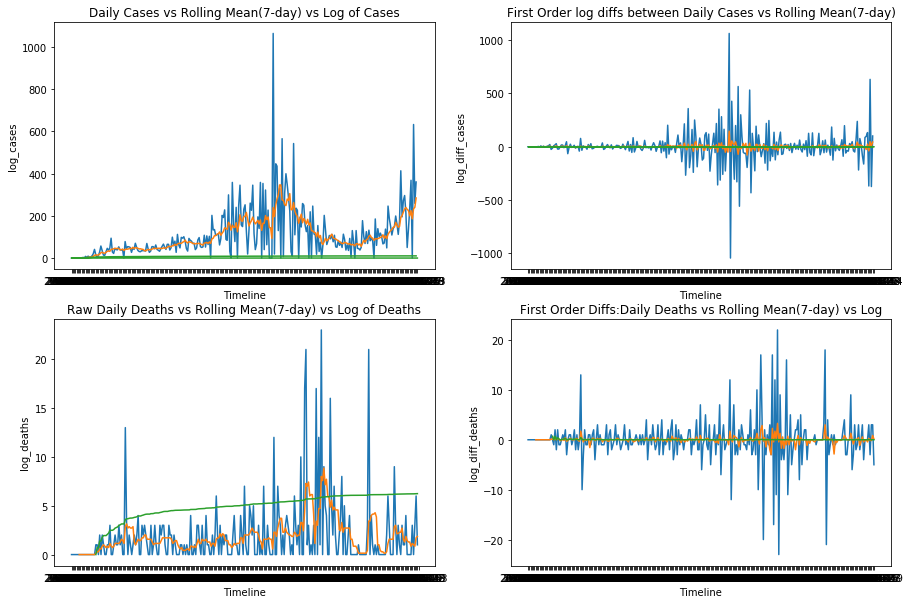
    


```python
# cases- scenario 1

# test for stationarity
adf_test(data.log_cases)
kpss_test(data.log_cases)

# modelling
data1 = data[0:100]
endog = data1['log_cases']
endog.plot(figsize=(15, 5))

# Step 1: fit model parameters w/ training sample

training_endog = endog[:'2020-07-02']
test_endog = endog['2020-07-03':'2020-07-09']
training_mod = sm.tsa.SARIMAX(training_endog, order=(3, 2, 7), trend='c')
training_res = training_mod.fit()

# Print the estimated parameters
print(training_res.params)

# Step 2: produce one-step-ahead forecasts
log_fcast = training_res.get_forecast(7)
results = np.exp(log_fcast.summary_frame())
results['actuals'] = data1['n_cases']
results = results.drop('mean_se', axis =1)
results = results.rename(columns={"mean":"fcast"}, copy =False)
rmse = np.sqrt(((results.actuals - results.fcast)**2).mean())
print(rmse, "RMSE")

# plot results
plt.figure(figsize=(15,5))

sns.lineplot(data = results, x= results.index, y="mean_ci_lower")
sns.lineplot(data = results, x= results.index, y="fcast")
sns.lineplot(data = results, x= results.index, y="actuals")
sns.lineplot(data = results, x= results.index, y="mean_ci_upper")

plt.xlabel("Timeline")
plt.title('forecast vs actuals')


plt.show()
```

    Results of Dickey-Fuller Test:
    Test Statistic                  -3.451167
    p-value                          0.009333
    #Lags Used                       8.000000
    Number of Observations Used    234.000000
    Critical Value (1%)             -3.458608
    Critical Value (5%)             -2.873972
    Critical Value (10%)            -2.573396
    dtype: float64
    Results of KPSS Test:
    Test Statistic            1.543366
    p-value                   0.010000
    Lags Used                15.000000
    Critical Value (10%)      0.347000
    Critical Value (5%)       0.463000
    Critical Value (2.5%)     0.574000
    Critical Value (1%)       0.739000
    dtype: float64


    /Users/raviivaturi/opt/anaconda3/lib/python3.7/site-packages/statsmodels/tsa/stattools.py:1708: InterpolationWarning: p-value is smaller than the indicated p-value
      warn("p-value is smaller than the indicated p-value", InterpolationWarning)
    /Users/raviivaturi/opt/anaconda3/lib/python3.7/site-packages/statsmodels/base/model.py:512: ConvergenceWarning: Maximum Likelihood optimization failed to converge. Check mle_retvals
      "Check mle_retvals", ConvergenceWarning)


    intercept   -0.002243
    ar.L1       -0.236717
    ar.L2       -0.309001
    ar.L3       -0.300790
    ma.L1       -0.531925
    ma.L2        0.081222
    ma.L3        0.304205
    ma.L4       -0.111304
    ma.L5       -0.210034
    ma.L6        0.650007
    ma.L7       -0.013470
    sigma2       0.000277
    dtype: float64
    210.36295579877878 RMSE


    
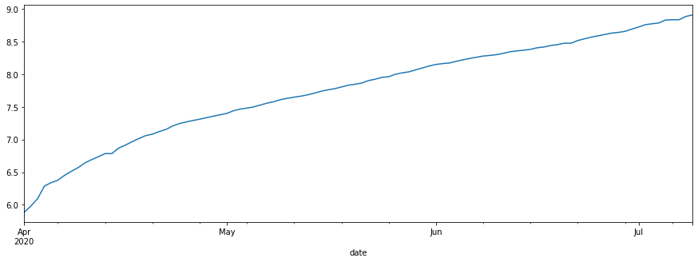
    


    
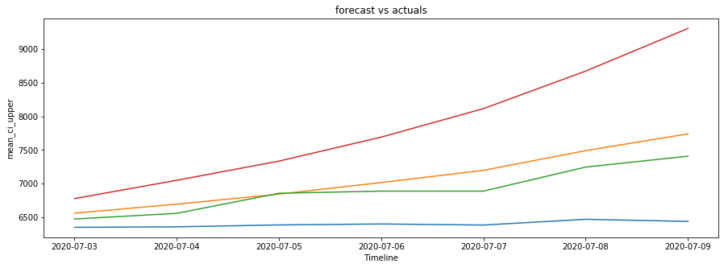
    


```python
# deaths- scenario 1

# test for stationarity
adf_test(data.log_deaths)
kpss_test(data.log_deaths)

# modelling
endog = data1['log_deaths']
endog.plot(figsize=(15, 5))

# Step 1: fit model parameters w/ training sample

training_endog = endog[:'2020-07-02']
test_endog = endog['2020-07-03':'2020-07-09']
training_mod = sm.tsa.SARIMAX(training_endog, order=(14, 2, 7), trend='c')
training_res = training_mod.fit()

# Print the estimated parameters
print(training_res.params)

# Step 2: produce one-step-ahead forecasts
log_fcast = training_res.get_forecast(7)
results = np.exp(log_fcast.summary_frame())
results['actuals'] = data1['n_deaths']
results = results.drop('mean_se', axis =1)
results = results.rename(columns={"mean":"fcast"}, copy =False)
rmse = np.sqrt(((results.actuals - results.fcast)**2).mean())
print(rmse, "RMSE")

# plot results
plt.figure(figsize=(15,5))

sns.lineplot(data = results, x= results.index, y="mean_ci_lower")
sns.lineplot(data = results, x= results.index, y="fcast")
sns.lineplot(data = results, x= results.index, y="actuals")
sns.lineplot(data = results, x= results.index, y="mean_ci_upper")

plt.xlabel("Timeline")
plt.title('forecast vs actuals')


```

    Results of Dickey-Fuller Test:
    Test Statistic                  -2.058700
    p-value                          0.261443
    #Lags Used                      15.000000
    Number of Observations Used    227.000000
    Critical Value (1%)             -3.459490
    Critical Value (5%)             -2.874358
    Critical Value (10%)            -2.573602
    dtype: float64
    Results of KPSS Test:
    Test Statistic            1.53923
    p-value                   0.01000
    Lags Used                15.00000
    Critical Value (10%)      0.34700
    Critical Value (5%)       0.46300
    Critical Value (2.5%)     0.57400
    Critical Value (1%)       0.73900
    dtype: float64


    /Users/raviivaturi/opt/anaconda3/lib/python3.7/site-packages/statsmodels/tsa/stattools.py:1708: InterpolationWarning: p-value is smaller than the indicated p-value
      warn("p-value is smaller than the indicated p-value", InterpolationWarning)
    /Users/raviivaturi/opt/anaconda3/lib/python3.7/site-packages/statsmodels/base/model.py:512: ConvergenceWarning: Maximum Likelihood optimization failed to converge. Check mle_retvals
      "Check mle_retvals", ConvergenceWarning)


    intercept   -0.002836
    ar.L1       -0.549991
    ar.L2       -0.402448
    ar.L3       -0.159946
    ar.L4       -0.207508
    ar.L5       -0.126054
    ar.L6       -0.112522
    ar.L7       -0.068822
    ar.L8        0.046319
    ar.L9       -0.001630
    ar.L10      -0.082268
    ar.L11      -0.366144
    ar.L12       0.072346
    ar.L13       0.104889
    ar.L14       0.056373
    ma.L1       -0.378728
    ma.L2       -0.402479
    ma.L3        0.033542
    ma.L4        0.021925
    ma.L5        0.048139
    ma.L6       -0.081225
    ma.L7        0.068656
    sigma2       0.002146
    dtype: float64
    2.2294894286985425 RMSE


    Text(0.5, 1.0, 'forecast vs actuals')


    
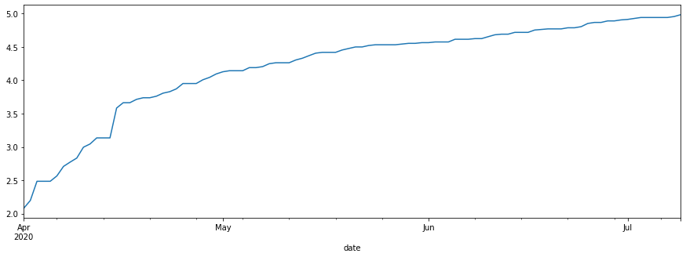
    


    
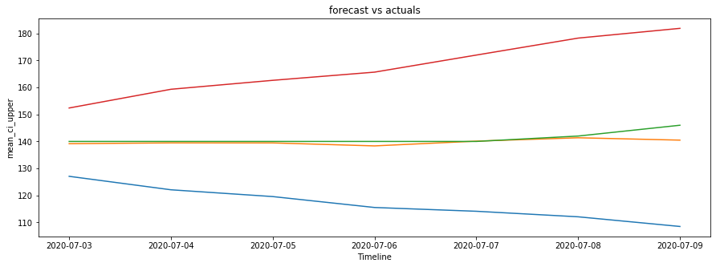
    


```python
# cases-scenario 2
data1 = data[120:200]
endog = data1['log_cases']
endog.plot(figsize=(15, 5))

# Step 1: fit model parameters w/ training sample

training_endog = endog[:'2020-10-10']
test_endog = endog['2020-10-11':'2020-10-17']
training_mod = sm.tsa.SARIMAX(training_endog, order=(3, 2, 7), trend='c')
training_res = training_mod.fit()

# Print the estimated parameters
print(training_res.params)

# Step 2: produce one-step-ahead forecasts
log_fcast = training_res.get_forecast(7)
results = np.exp(log_fcast.summary_frame())
results['actuals'] = data1['n_cases']
results = results.drop('mean_se', axis =1)
results = results.rename(columns={"mean":"fcast"}, copy =False)
rmse = np.sqrt(((results.actuals - results.fcast)**2).mean())
print(rmse, "RMSE")

# plot results
plt.figure(figsize=(15,5))

sns.lineplot(data = results, x= results.index, y="mean_ci_lower")
sns.lineplot(data = results, x= results.index, y="fcast")
sns.lineplot(data = results, x= results.index, y="actuals")
sns.lineplot(data = results, x= results.index, y="mean_ci_upper")

plt.xlabel("Timeline")
plt.title('forecast vs actuals')


plt.show()
```

    /Users/raviivaturi/opt/anaconda3/lib/python3.7/site-packages/statsmodels/base/model.py:512: ConvergenceWarning: Maximum Likelihood optimization failed to converge. Check mle_retvals
      "Check mle_retvals", ConvergenceWarning)


    intercept   -0.000859
    ar.L1       -1.298962
    ar.L2       -1.156051
    ar.L3       -0.402356
    ma.L1        0.063472
    ma.L2        0.035948
    ma.L3       -0.604172
    ma.L4       -0.274814
    ma.L5       -0.047753
    ma.L6       -0.170257
    ma.L7        0.343630
    sigma2       0.000115
    dtype: float64
    189.5719287581044 RMSE


    
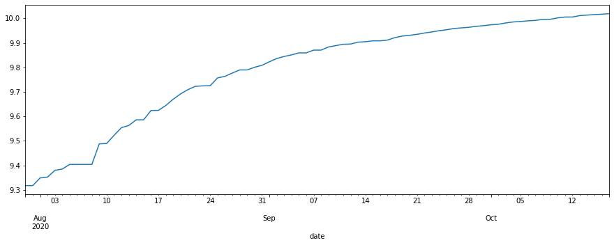
    


    
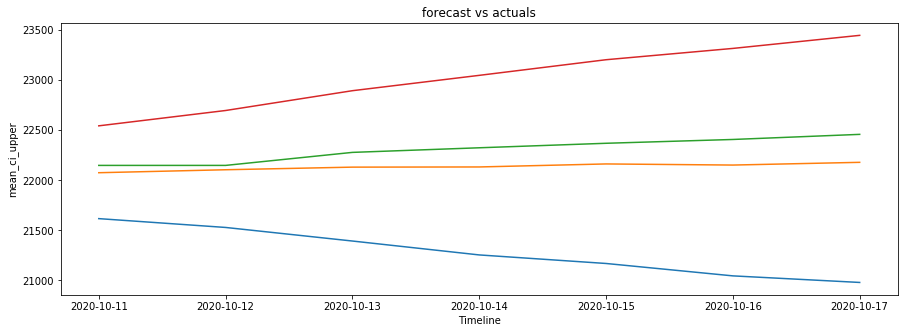
    


```python
# deaths-scenario 2
data1 = data[120:200]
endog = data1['log_deaths']
endog.plot(figsize=(15, 5))

# Step 1: fit model parameters w/ training sample

training_endog = endog[:'2020-10-10']
test_endog = endog['2020-10-11':'2020-10-17']
training_mod = sm.tsa.SARIMAX(training_endog, order=(14, 2, 7), trend='c')
training_res = training_mod.fit()

# Print the estimated parameters
print(training_res.params)

# Step 2: produce one-step-ahead forecasts
log_fcast = training_res.get_forecast(7)
results = np.exp(log_fcast.summary_frame())
results['actuals'] = data1['n_deaths']
results = results.drop('mean_se', axis =1)
results = results.rename(columns={"mean":"fcast"}, copy =False)
rmse = np.sqrt(((results.actuals - results.fcast)**2).mean())
print(rmse, "RMSE")

# plot results
plt.figure(figsize=(15,5))

sns.lineplot(data = results, x= results.index, y="mean_ci_lower")
sns.lineplot(data = results, x= results.index, y="fcast")
sns.lineplot(data = results, x= results.index, y="actuals")
sns.lineplot(data = results, x= results.index, y="mean_ci_upper")

plt.xlabel("Timeline")
plt.title('forecast vs actuals')


plt.show()
```

    /Users/raviivaturi/opt/anaconda3/lib/python3.7/site-packages/statsmodels/base/model.py:512: ConvergenceWarning: Maximum Likelihood optimization failed to converge. Check mle_retvals
      "Check mle_retvals", ConvergenceWarning)


    intercept   -0.000284
    ar.L1       -0.574587
    ar.L2       -0.312003
    ar.L3       -0.247495
    ar.L4       -0.162567
    ar.L5       -0.276738
    ar.L6       -0.177451
    ar.L7       -0.110024
    ar.L8        0.140258
    ar.L9        0.123589
    ar.L10      -0.051741
    ar.L11      -0.008053
    ar.L12       0.127215
    ar.L13       0.110904
    ar.L14       0.132797
    ma.L1       -0.429925
    ma.L2       -0.162460
    ma.L3       -0.044193
    ma.L4        0.068426
    ma.L5       -0.059462
    ma.L6       -0.117215
    ma.L7       -0.017841
    sigma2       0.000274
    dtype: float64
    7.9195790198289435 RMSE


    
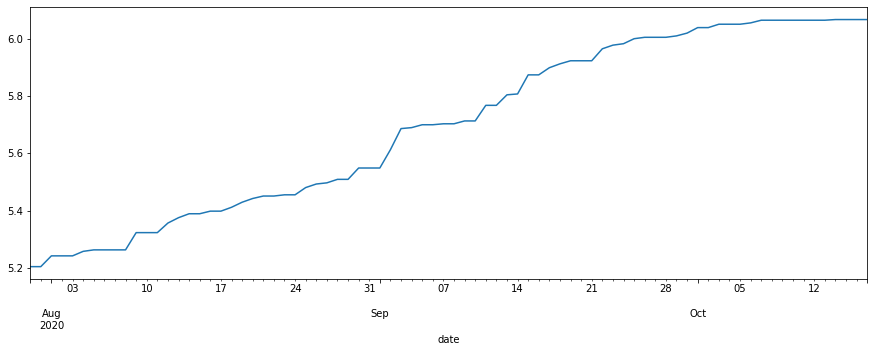
    


    
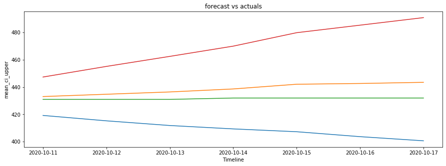
    


```python
# Los Angeles
#daily
Los_Angeles = cali[cali['CountyName'] == 'Los Angeles']
Los_Angeles['daily_cases'] = Los_Angeles['n_cases'].diff()
Los_Angeles['daily_deaths'] = Los_Angeles['n_deaths'].diff()
Los_Angeles['one_diff_cases'] = Los_Angeles['daily_cases'].diff()
Los_Angeles['one_diff_deaths'] = Los_Angeles['daily_deaths'].diff()


#log

Los_Angeles['log_cases'] = np.log(Los_Angeles['n_cases'])
Los_Angeles['log_deaths'] = np.log(Los_Angeles['n_deaths'])
Los_Angeles['log_diff_cases'] = Los_Angeles['log_cases'].diff()
Los_Angeles['log_diff_deaths'] = Los_Angeles['log_deaths'].diff()


# Construct daily, log counts and first order differences within daily counts and log counts
df3 = Los_Angeles[['date', 'n_cases','n_deaths','daily_cases','daily_deaths', 'one_diff_cases','one_diff_deaths', 'log_cases', 'log_deaths',
              'log_diff_cases', 'log_diff_deaths']]


df3['rolling_mean_cases'] = Los_Angeles.daily_cases.rolling(window=7).mean()
df3['rolling_mean_deaths'] = Los_Angeles.daily_deaths.rolling(window=7).mean()
df3['rolling_mean_one_diff_cases'] = Los_Angeles.one_diff_cases.rolling(window=7).mean()
df3['rolling_mean_one_diff_deaths'] = Los_Angeles.one_diff_deaths.rolling(window=7).mean()

# Analysis of daily Infections & deaths
plt.figure(figsize=(15,10))

plt.subplot(2,2,1)
sns.lineplot(data=df3, x="date", y="daily_cases")
sns.lineplot(data=df3, x="date", y="rolling_mean_cases")
sns.lineplot(data=df3, x="date", y="log_cases")
plt.xlabel("Timeline")
plt.title('Daily Cases vs Rolling Mean(7-day) vs Log of Cases')

plt.subplot(2,2,2)
sns.lineplot(data=df3, x="date", y="one_diff_cases")
sns.lineplot(data=df3, x="date", y="rolling_mean_one_diff_cases")
sns.lineplot(data=df3, x="date", y="log_diff_cases")
plt.xlabel("Timeline")
plt.title('First Order log diffs between Daily Cases vs Rolling Mean(7-day)')

plt.subplot(2,2,3)
sns.lineplot(data=df3, x="date", y="daily_deaths")
sns.lineplot(data=df3, x="date", y="rolling_mean_deaths")
sns.lineplot(data=df3, x="date", y="log_deaths")
plt.xlabel("Timeline")
plt.title('Raw Daily Deaths vs Rolling Mean(7-day) vs Log of Deaths')

plt.subplot(2,2,4)
sns.lineplot(data=df3, x="date", y="one_diff_deaths")
sns.lineplot(data=df3, x="date", y="rolling_mean_one_diff_deaths")
sns.lineplot(data=df3, x="date", y="log_diff_deaths")


plt.xlabel("Timeline")
plt.title('First Order Diffs:Daily Deaths vs Rolling Mean(7-day) vs Log')

plt.show()

# prepare data

df4 = df3.reset_index().drop('countyFIPS', axis = 1)
df4 = df4.set_index('date')
df4.index = pd.to_datetime(df4.index)
df4.index.freq = 'd'
data= df4['2020-04-01':]
```


    
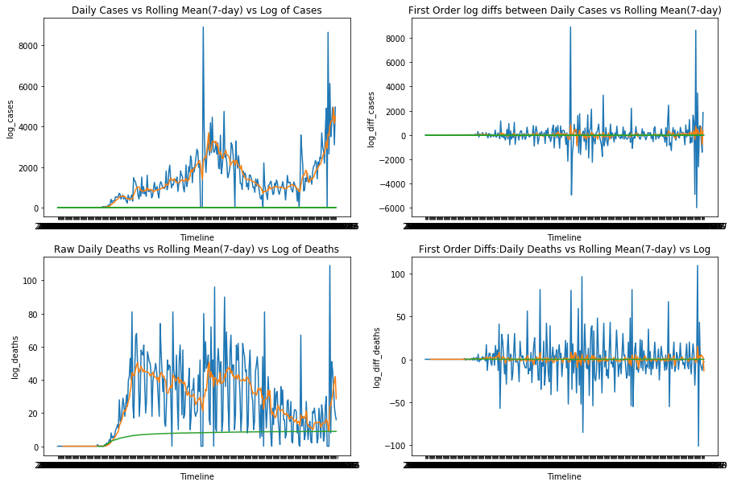
    


```python
# cases-scenario 1

# test for stationarity
adf_test(data.log_cases)
kpss_test(data.log_cases)

# modelling

import statsmodels.api as sm
data1 = data[0:100]
endog = data1['log_cases']
endog.plot(figsize=(15, 5))

# Step 1: fit model parameters w/ training sample

training_endog = endog[:'2020-07-02']
test_endog = endog['2020-07-03':'2020-07-09']
training_mod = sm.tsa.SARIMAX(training_endog, order=(3, 2, 7), trend='c')
training_res = training_mod.fit()

# Print the estimated parameters
print(training_res.params)

# Step 2: produce one-step-ahead forecasts
log_fcast = training_res.get_forecast(7)
results = np.exp(log_fcast.summary_frame())
results['actuals'] = data1['n_cases']
results = results.drop('mean_se', axis =1)
results = results.rename(columns={"mean":"fcast"}, copy =False)
rmse = np.sqrt(((results.actuals - results.fcast)**2).mean())
print(rmse, "RMSE")

# plot results
plt.figure(figsize=(15,5))

sns.lineplot(data = results, x= results.index, y="mean_ci_lower")
sns.lineplot(data = results, x= results.index, y="fcast")
sns.lineplot(data = results, x= results.index, y="actuals")
sns.lineplot(data = results, x= results.index, y="mean_ci_upper")

plt.xlabel("Timeline")
plt.title('forecast vs actuals')


plt.show()
```

    Results of Dickey-Fuller Test:
    Test Statistic                  -1.680679
    p-value                          0.441094
    #Lags Used                      15.000000
    Number of Observations Used    227.000000
    Critical Value (1%)             -3.459490
    Critical Value (5%)             -2.874358
    Critical Value (10%)            -2.573602
    dtype: float64
    Results of KPSS Test:
    Test Statistic            1.460778
    p-value                   0.010000
    Lags Used                15.000000
    Critical Value (10%)      0.347000
    Critical Value (5%)       0.463000
    Critical Value (2.5%)     0.574000
    Critical Value (1%)       0.739000
    dtype: float64


    /Users/raviivaturi/opt/anaconda3/lib/python3.7/site-packages/statsmodels/tsa/stattools.py:1708: InterpolationWarning: p-value is smaller than the indicated p-value
      warn("p-value is smaller than the indicated p-value", InterpolationWarning)
    /Users/raviivaturi/opt/anaconda3/lib/python3.7/site-packages/statsmodels/base/model.py:512: ConvergenceWarning: Maximum Likelihood optimization failed to converge. Check mle_retvals
      "Check mle_retvals", ConvergenceWarning)


    intercept   -0.000544
    ar.L1       -0.623919
    ar.L2        0.573495
    ar.L3        0.448830
    ma.L1        0.240510
    ma.L2       -0.816857
    ma.L3       -0.273834
    ma.L4       -0.036364
    ma.L5       -0.420704
    ma.L6        0.127298
    ma.L7        0.343602
    sigma2       0.000221
    dtype: float64
    4767.863236748032 RMSE


    
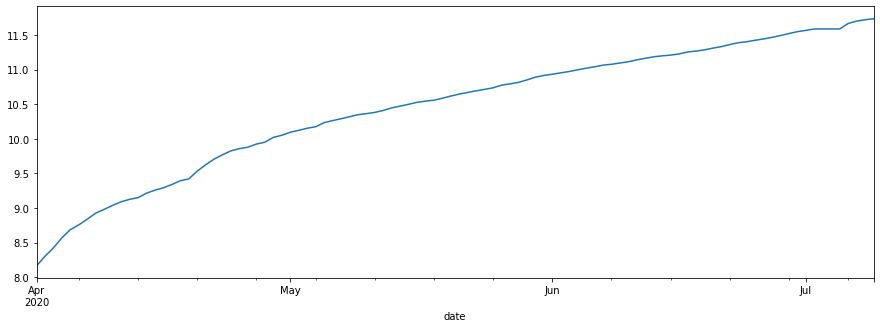
    


    
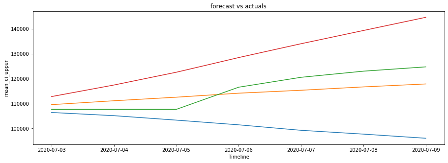
    


```python
# deaths- scenario 1

# test for stationarity
adf_test(data.log_deaths)
kpss_test(data.log_deaths)

# modelling
endog = data1['log_deaths']
endog.plot(figsize=(15, 5))

# Step 1: fit model parameters w/ training sample

training_endog = endog[:'2020-07-02']
test_endog = endog['2020-07-03':'2020-07-09']
training_mod = sm.tsa.SARIMAX(training_endog, order=(14, 2, 7), trend='c')
training_res = training_mod.fit()

# Print the estimated parameters
print(training_res.params)

# Step 2: produce one-step-ahead forecasts
log_fcast = training_res.get_forecast(7)
results = np.exp(log_fcast.summary_frame())
results['actuals'] = data1['n_deaths']
results = results.drop('mean_se', axis =1)
results = results.rename(columns={"mean":"fcast"}, copy =False)
rmse = np.sqrt(((results.actuals - results.fcast)**2).mean())
print(rmse, "RMSE")

# plot results
plt.figure(figsize=(15,5))

sns.lineplot(data = results, x= results.index, y="mean_ci_lower")
sns.lineplot(data = results, x= results.index, y="fcast")
sns.lineplot(data = results, x= results.index, y="actuals")
sns.lineplot(data = results, x= results.index, y="mean_ci_upper")

plt.xlabel("Timeline")
plt.title('forecast vs actuals')


```

    Results of Dickey-Fuller Test:
    Test Statistic                  -2.372021
    p-value                          0.149790
    #Lags Used                      15.000000
    Number of Observations Used    227.000000
    Critical Value (1%)             -3.459490
    Critical Value (5%)             -2.874358
    Critical Value (10%)            -2.573602
    dtype: float64
    Results of KPSS Test:
    Test Statistic            1.313847
    p-value                   0.010000
    Lags Used                15.000000
    Critical Value (10%)      0.347000
    Critical Value (5%)       0.463000
    Critical Value (2.5%)     0.574000
    Critical Value (1%)       0.739000
    dtype: float64


    /Users/raviivaturi/opt/anaconda3/lib/python3.7/site-packages/statsmodels/tsa/stattools.py:1708: InterpolationWarning: p-value is smaller than the indicated p-value
      warn("p-value is smaller than the indicated p-value", InterpolationWarning)
    /Users/raviivaturi/opt/anaconda3/lib/python3.7/site-packages/statsmodels/base/model.py:512: ConvergenceWarning: Maximum Likelihood optimization failed to converge. Check mle_retvals
      "Check mle_retvals", ConvergenceWarning)


    intercept   -0.000430
    ar.L1       -0.884925
    ar.L2       -0.618647
    ar.L3       -0.279941
    ar.L4        0.189860
    ar.L5        0.430198
    ar.L6        0.713162
    ar.L7        0.917198
    ar.L8        0.638730
    ar.L9        0.412463
    ar.L10       0.192317
    ar.L11      -0.162490
    ar.L12      -0.333472
    ar.L13      -0.515267
    ar.L14       0.066550
    ma.L1        0.284813
    ma.L2       -0.004747
    ma.L3       -0.171083
    ma.L4       -0.231469
    ma.L5       -0.255945
    ma.L6       -0.345803
    ma.L7       -0.243545
    sigma2       0.000318
    dtype: float64
    74.61440427303472 RMSE


    Text(0.5, 1.0, 'forecast vs actuals')


    
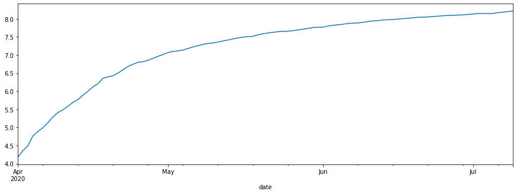
    


    
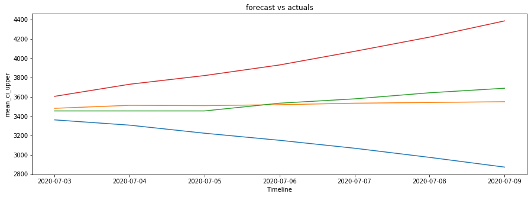
    


```python
# cases -scenario 2
data1 = data[120:200]
endog = data1['log_cases']
endog.plot(figsize=(15, 5))

# Step 1: fit model parameters w/ training sample

training_endog = endog[:'2020-10-10']
test_endog = endog['2020-10-11':'2020-10-17']
training_mod = sm.tsa.SARIMAX(training_endog, order=(3, 2, 7), trend='c')
training_res = training_mod.fit()

# Print the estimated parameters
print(training_res.params)

# Step 2: produce one-step-ahead forecasts
log_fcast = training_res.get_forecast(7)
results = np.exp(log_fcast.summary_frame())
results['actuals'] = data1['n_cases']
results = results.drop('mean_se', axis =1)
results = results.rename(columns={"mean":"fcast"}, copy =False)
rmse = np.sqrt(((results.actuals - results.fcast)**2).mean())
print(rmse, "RMSE")

# plot results
plt.figure(figsize=(15,5))

sns.lineplot(data = results, x= results.index, y="mean_ci_lower")
sns.lineplot(data = results, x= results.index, y="fcast")
sns.lineplot(data = results, x= results.index, y="actuals")
sns.lineplot(data = results, x= results.index, y="mean_ci_upper")

plt.xlabel("Timeline")
plt.title('forecast vs actuals')


plt.show()
```

    intercept   -0.000179
    ar.L1       -0.374308
    ar.L2       -0.079592
    ar.L3       -0.007587
    ma.L1       -0.326546
    ma.L2       -0.056565
    ma.L3        0.039335
    ma.L4       -0.291853
    ma.L5        0.033305
    ma.L6       -0.001092
    ma.L7        0.148290
    sigma2       0.000006
    dtype: float64
    254.48046334642197 RMSE


    
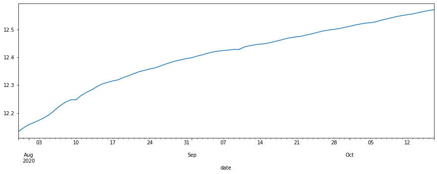
    


    
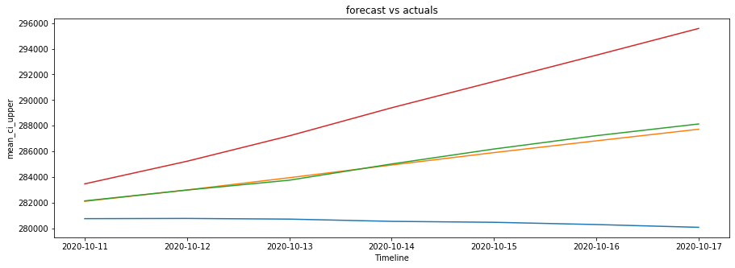
    


```python
# deaths-scenario 2
data1 = data[120:200]
endog = data1['log_deaths']
endog.plot(figsize=(15, 5))

# Step 1: fit model parameters w/ training sample

training_endog = endog[:'2020-10-10']
test_endog = endog['2020-10-11':'2020-10-17']
training_mod = sm.tsa.SARIMAX(training_endog, order=(14, 2, 7), trend='c')
training_res = training_mod.fit()

# Print the estimated parameters
print(training_res.params)

# Step 2: produce one-step-ahead forecasts
log_fcast = training_res.get_forecast(7)
results = np.exp(log_fcast.summary_frame())
results['actuals'] = data1['n_deaths']
results = results.drop('mean_se', axis =1)
results = results.rename(columns={"mean":"fcast"}, copy =False)
rmse = np.sqrt(((results.actuals - results.fcast)**2).mean())
print(rmse, "RMSE")

# plot results
plt.figure(figsize=(15,5))

sns.lineplot(data = results, x= results.index, y="mean_ci_lower")
sns.lineplot(data = results, x= results.index, y="fcast")
sns.lineplot(data = results, x= results.index, y="actuals")
sns.lineplot(data = results, x= results.index, y="mean_ci_upper")

plt.xlabel("Timeline")
plt.title('forecast vs actuals')


plt.show()
```

    intercept   -0.000118
    ar.L1       -0.252416
    ar.L2       -0.032119
    ar.L3       -0.109241
    ar.L4        0.071729
    ar.L5       -0.059452
    ar.L6        0.113203
    ar.L7        0.146844
    ar.L8        0.010001
    ar.L9       -0.110328
    ar.L10      -0.137403
    ar.L11       0.004049
    ar.L12      -0.134794
    ar.L13       0.188357
    ar.L14       0.216107
    ma.L1       -0.205815
    ma.L2       -0.005603
    ma.L3       -0.181979
    ma.L4       -0.007829
    ma.L5       -0.166200
    ma.L6        0.023015
    ma.L7        0.248278
    sigma2       0.000008
    dtype: float64
    40.61082036643791 RMSE


    
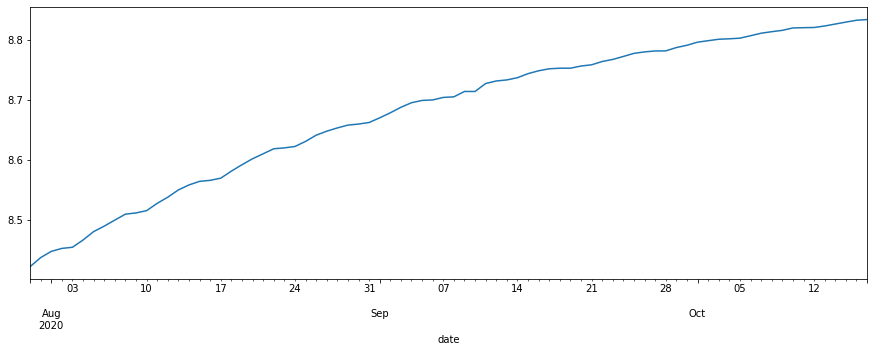
    


    
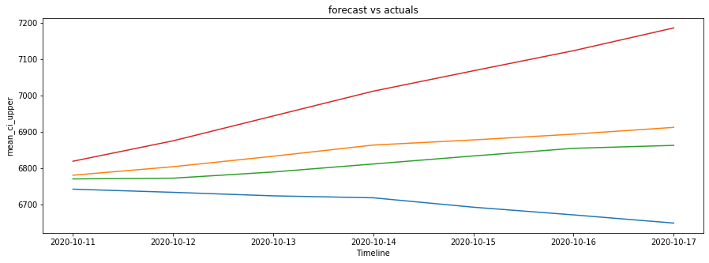
    


```python
# Napa

Napa = cali[cali['CountyName'] == 'Napa']
Napa['daily_cases'] = Napa['n_cases'].diff()
Napa['daily_deaths'] = Napa['n_deaths'].diff()
Napa['one_diff_cases'] = Napa['daily_cases'].diff()
Napa['one_diff_deaths'] = Napa['daily_deaths'].diff()

#log

Napa['log_cases'] = np.log(Napa['n_cases'])
Napa['log_deaths'] = np.log(Napa['n_deaths'])
Napa['log_diff_cases'] = Napa['log_cases'].diff()
Napa['log_diff_deaths'] = Napa['log_deaths'].diff()


# Construct daily, log counts and first order differences within daily counts and log counts
df3 = Napa[['date', 'n_cases','n_deaths','daily_cases','daily_deaths', 'one_diff_cases','one_diff_deaths', 'log_cases', 'log_deaths',
              'log_diff_cases', 'log_diff_deaths']]


df3['rolling_mean_cases'] = Napa.daily_cases.rolling(window=7).mean()
df3['rolling_mean_deaths'] = Napa.daily_deaths.rolling(window=7).mean()
df3['rolling_mean_one_diff_cases'] = Napa.one_diff_cases.rolling(window=7).mean()
df3['rolling_mean_one_diff_deaths'] = Napa.one_diff_deaths.rolling(window=7).mean()

# Analysis of daily Infections & deaths
plt.figure(figsize=(15,10))

plt.subplot(2,2,1)
sns.lineplot(data=df3, x="date", y="daily_cases")
sns.lineplot(data=df3, x="date", y="rolling_mean_cases")
sns.lineplot(data=df3, x="date", y="log_cases")
plt.xlabel("Timeline")
plt.title('Daily Cases vs Rolling Mean(7-day) vs Log of Cases')

plt.subplot(2,2,2)
sns.lineplot(data=df3, x="date", y="one_diff_cases")
sns.lineplot(data=df3, x="date", y="rolling_mean_one_diff_cases")
sns.lineplot(data=df3, x="date", y="log_diff_cases")
plt.xlabel("Timeline")
plt.title('First Order log diffs between Daily Cases vs Rolling Mean(7-day)')

plt.subplot(2,2,3)
sns.lineplot(data=df3, x="date", y="daily_deaths")
sns.lineplot(data=df3, x="date", y="rolling_mean_deaths")
sns.lineplot(data=df3, x="date", y="log_deaths")
plt.xlabel("Timeline")
plt.title('Raw Daily Deaths vs Rolling Mean(7-day) vs Log of Deaths')

plt.subplot(2,2,4)
sns.lineplot(data=df3, x="date", y="one_diff_deaths")
sns.lineplot(data=df3, x="date", y="rolling_mean_one_diff_deaths")
sns.lineplot(data=df3, x="date", y="log_diff_deaths")


plt.xlabel("Timeline")
plt.title('First Order Diffs:Daily Deaths vs Rolling Mean(7-day) vs Log')

plt.show()

# prepare data

df4 = df3.reset_index().drop('countyFIPS', axis = 1)
df4 = df4.set_index('date')
df4.index = pd.to_datetime(df4.index)
df4.index.freq = 'd'
data= df4['2020-04-01':]
```


    
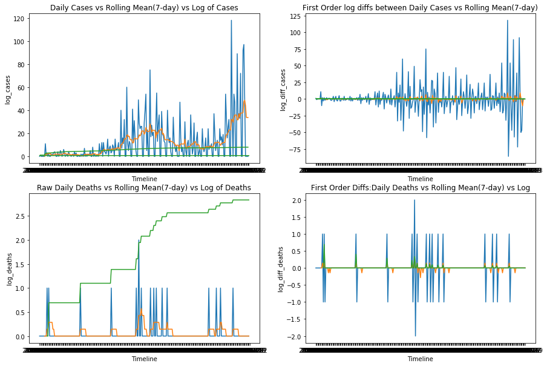
    


```python
# cases-scenario 1

# test for stationarity
adf_test(data.log_cases)
kpss_test(data.log_cases)

# modelling

import statsmodels.api as sm
data1 = data[0:100]
endog = data1['log_cases']
endog.plot(figsize=(15, 5))

# Step 1: fit model parameters w/ training sample

training_endog = endog[:'2020-07-02']
test_endog = endog['2020-07-03':'2020-07-09']
training_mod = sm.tsa.SARIMAX(training_endog, order=(3, 2, 7), trend='c')
training_res = training_mod.fit()

# Print the estimated parameters
print(training_res.params)

# Step 2: produce one-step-ahead forecasts
log_fcast = training_res.get_forecast(7)
results = np.exp(log_fcast.summary_frame())
results['actuals'] = data1['n_cases']
results = results.drop('mean_se', axis =1)
results = results.rename(columns={"mean":"fcast"}, copy =False)
rmse = np.sqrt(((results.actuals - results.fcast)**2).mean())
print(rmse, "RMSE")

# plot results
plt.figure(figsize=(15,5))

sns.lineplot(data = results, x= results.index, y="mean_ci_lower")
sns.lineplot(data = results, x= results.index, y="fcast")
sns.lineplot(data = results, x= results.index, y="actuals")
sns.lineplot(data = results, x= results.index, y="mean_ci_upper")

plt.xlabel("Timeline")
plt.title('forecast vs actuals')


plt.show()
```

    Results of Dickey-Fuller Test:
    Test Statistic                  -1.721175
    p-value                          0.420237
    #Lags Used                       8.000000
    Number of Observations Used    234.000000
    Critical Value (1%)             -3.458608
    Critical Value (5%)             -2.873972
    Critical Value (10%)            -2.573396
    dtype: float64
    Results of KPSS Test:
    Test Statistic            1.557928
    p-value                   0.010000
    Lags Used                15.000000
    Critical Value (10%)      0.347000
    Critical Value (5%)       0.463000
    Critical Value (2.5%)     0.574000
    Critical Value (1%)       0.739000
    dtype: float64


    /Users/raviivaturi/opt/anaconda3/lib/python3.7/site-packages/statsmodels/tsa/stattools.py:1708: InterpolationWarning: p-value is smaller than the indicated p-value
      warn("p-value is smaller than the indicated p-value", InterpolationWarning)
    /Users/raviivaturi/opt/anaconda3/lib/python3.7/site-packages/statsmodels/base/model.py:512: ConvergenceWarning: Maximum Likelihood optimization failed to converge. Check mle_retvals
      "Check mle_retvals", ConvergenceWarning)


    intercept   -0.000542
    ar.L1       -0.929768
    ar.L2       -0.866329
    ar.L3       -0.331588
    ma.L1       -0.171728
    ma.L2        0.055052
    ma.L3       -0.445795
    ma.L4       -0.227664
    ma.L5        0.013458
    ma.L6       -0.209387
    ma.L7        0.429236
    sigma2       0.001060
    dtype: float64
    25.688715921759364 RMSE


    
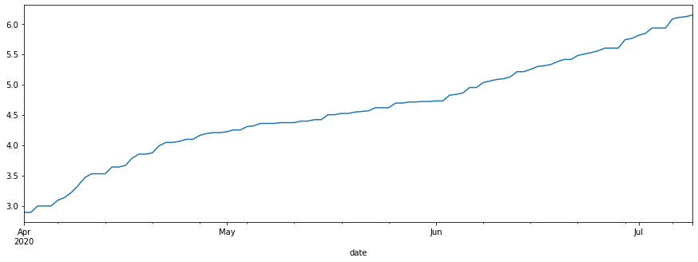
    


    
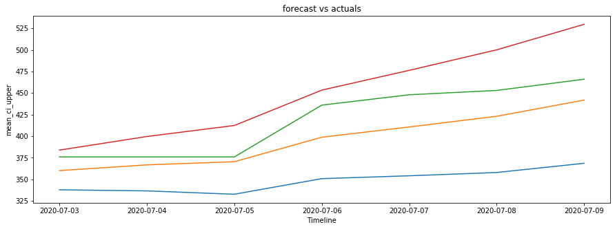
    


```python
# deaths- scenario 1

# test for stationarity
adf_test(data.log_deaths)
kpss_test(data.log_deaths)

# modelling
endog = data1['log_deaths']
endog.plot(figsize=(15, 5))

# Step 1: fit model parameters w/ training sample

training_endog = endog[:'2020-07-02']
test_endog = endog['2020-07-03':'2020-07-09']
training_mod = sm.tsa.SARIMAX(training_endog, order=(14, 2, 7), trend='c')
training_res = training_mod.fit()

# Print the estimated parameters
print(training_res.params)

# Step 2: produce one-step-ahead forecasts
log_fcast = training_res.get_forecast(7)
results = np.exp(log_fcast.summary_frame())
results['actuals'] = data1['n_deaths']
results = results.drop('mean_se', axis =1)
results = results.rename(columns={"mean":"fcast"}, copy =False)
rmse = np.sqrt(((results.actuals - results.fcast)**2).mean())
print(rmse, "RMSE")

# plot results
plt.figure(figsize=(15,5))

sns.lineplot(data = results, x= results.index, y="mean_ci_lower")
sns.lineplot(data = results, x= results.index, y="fcast")
sns.lineplot(data = results, x= results.index, y="actuals")
sns.lineplot(data = results, x= results.index, y="mean_ci_upper")

plt.xlabel("Timeline")
plt.title('forecast vs actuals')

plt.show()

```

    Results of Dickey-Fuller Test:
    Test Statistic                  -0.798590
    p-value                          0.819536
    #Lags Used                       3.000000
    Number of Observations Used    239.000000
    Critical Value (1%)             -3.458011
    Critical Value (5%)             -2.873710
    Critical Value (10%)            -2.573256
    dtype: float64
    Results of KPSS Test:
    Test Statistic            1.568259
    p-value                   0.010000
    Lags Used                15.000000
    Critical Value (10%)      0.347000
    Critical Value (5%)       0.463000
    Critical Value (2.5%)     0.574000
    Critical Value (1%)       0.739000
    dtype: float64


    /Users/raviivaturi/opt/anaconda3/lib/python3.7/site-packages/statsmodels/tsa/stattools.py:1708: InterpolationWarning: p-value is smaller than the indicated p-value
      warn("p-value is smaller than the indicated p-value", InterpolationWarning)
    /Users/raviivaturi/opt/anaconda3/lib/python3.7/site-packages/statsmodels/base/model.py:512: ConvergenceWarning: Maximum Likelihood optimization failed to converge. Check mle_retvals
      "Check mle_retvals", ConvergenceWarning)


    intercept   -0.001339
    ar.L1       -0.890021
    ar.L2       -0.593508
    ar.L3       -0.529988
    ar.L4       -0.376106
    ar.L5       -0.281563
    ar.L6       -0.193844
    ar.L7       -0.116495
    ar.L8       -0.112713
    ar.L9       -0.107192
    ar.L10      -0.100402
    ar.L11      -0.089646
    ar.L12      -0.074827
    ar.L13      -0.056379
    ar.L14      -0.028743
    ma.L1       -0.140768
    ma.L2       -0.343987
    ma.L3       -0.059611
    ma.L4       -0.129035
    ma.L5       -0.078959
    ma.L6       -0.102214
    ma.L7       -0.101849
    sigma2       0.007601
    dtype: float64
    0.0027870721468285387 RMSE


    
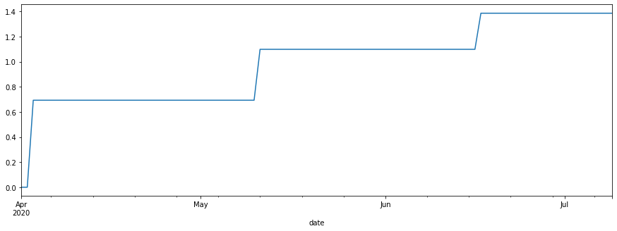
    


    
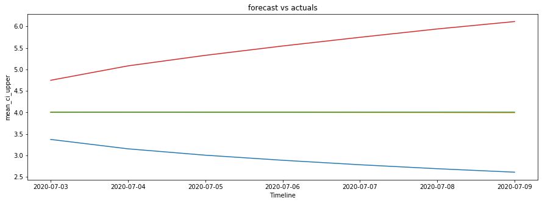
    


```python
# cases -scenario 2
data1 = data[120:200]
endog = data1['log_cases']
endog.plot(figsize=(15, 5))

# Step 1: fit model parameters w/ training sample

training_endog = endog[:'2020-10-10']
test_endog = endog['2020-10-11':'2020-10-17']
training_mod = sm.tsa.SARIMAX(training_endog, order=(3, 2, 7), trend='c')
training_res = training_mod.fit()

# Print the estimated parameters
print(training_res.params)

# Step 2: produce one-step-ahead forecasts
log_fcast = training_res.get_forecast(7)
results = np.exp(log_fcast.summary_frame())
results['actuals'] = data1['n_cases']
results = results.drop('mean_se', axis =1)
results = results.rename(columns={"mean":"fcast"}, copy =False)
rmse = np.sqrt(((results.actuals - results.fcast)**2).mean())
print(rmse, "RMSE")

# plot results
plt.figure(figsize=(15,5))

sns.lineplot(data = results, x= results.index, y="mean_ci_lower")
sns.lineplot(data = results, x= results.index, y="fcast")
sns.lineplot(data = results, x= results.index, y="actuals")
sns.lineplot(data = results, x= results.index, y="mean_ci_upper")

plt.xlabel("Timeline")
plt.title('forecast vs actuals')


plt.show()
```

    /Users/raviivaturi/opt/anaconda3/lib/python3.7/site-packages/statsmodels/base/model.py:512: ConvergenceWarning: Maximum Likelihood optimization failed to converge. Check mle_retvals
      "Check mle_retvals", ConvergenceWarning)


    intercept   -0.000827
    ar.L1       -0.706625
    ar.L2       -0.808873
    ar.L3       -0.304827
    ma.L1       -0.474978
    ma.L2        0.105517
    ma.L3       -0.290607
    ma.L4       -0.255606
    ma.L5       -0.107632
    ma.L6       -0.062468
    ma.L7        0.464556
    sigma2       0.000115
    dtype: float64
    27.368083957310073 RMSE


    
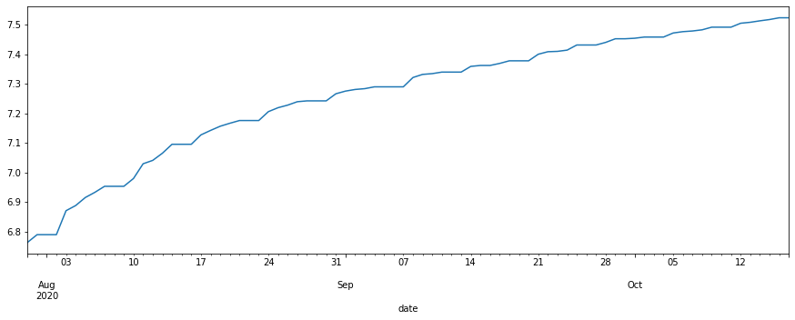
    


    
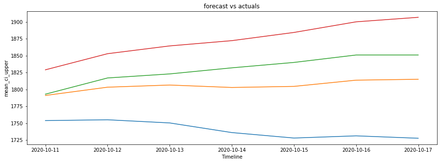
    


```python
# deaths-scenario 2
data1 = data[120:200]
endog = data1['log_deaths']
endog.plot(figsize=(15, 5))

# Step 1: fit model parameters w/ training sample

training_endog = endog[:'2020-10-10']
test_endog = endog['2020-10-11':'2020-10-17']
training_mod = sm.tsa.SARIMAX(training_endog, order=(14, 2, 7), trend='c')
training_res = training_mod.fit()

# Print the estimated parameters
print(training_res.params)

# Step 2: produce one-step-ahead forecasts
log_fcast = training_res.get_forecast(7)
results = np.exp(log_fcast.summary_frame())
results['actuals'] = data1['n_deaths']
results = results.drop('mean_se', axis =1)
results = results.rename(columns={"mean":"fcast"}, copy =False)
rmse = np.sqrt(((results.actuals - results.fcast)**2).mean())
print(rmse, "RMSE")

# plot results
plt.figure(figsize=(15,5))

sns.lineplot(data = results, x= results.index, y="mean_ci_lower")
sns.lineplot(data = results, x= results.index, y="fcast")
sns.lineplot(data = results, x= results.index, y="actuals")
sns.lineplot(data = results, x= results.index, y="mean_ci_upper")

plt.xlabel("Timeline")
plt.title('forecast vs actuals')


plt.show()
```

    /Users/raviivaturi/opt/anaconda3/lib/python3.7/site-packages/statsmodels/base/model.py:512: ConvergenceWarning: Maximum Likelihood optimization failed to converge. Check mle_retvals
      "Check mle_retvals", ConvergenceWarning)


    intercept   -0.001078
    ar.L1       -0.625770
    ar.L2       -0.309546
    ar.L3       -0.261497
    ar.L4       -0.203720
    ar.L5       -0.081315
    ar.L6        0.091158
    ar.L7        0.071675
    ar.L8       -0.146612
    ar.L9       -0.231790
    ar.L10      -0.046660
    ar.L11      -0.205602
    ar.L12      -0.266332
    ar.L13       0.026522
    ar.L14       0.329257
    ma.L1       -0.480684
    ma.L2       -0.392677
    ma.L3       -0.054175
    ma.L4        0.178297
    ma.L5       -0.061047
    ma.L6       -0.197965
    ma.L7        0.271656
    sigma2       0.000384
    dtype: float64
    1.121429725232361 RMSE


    
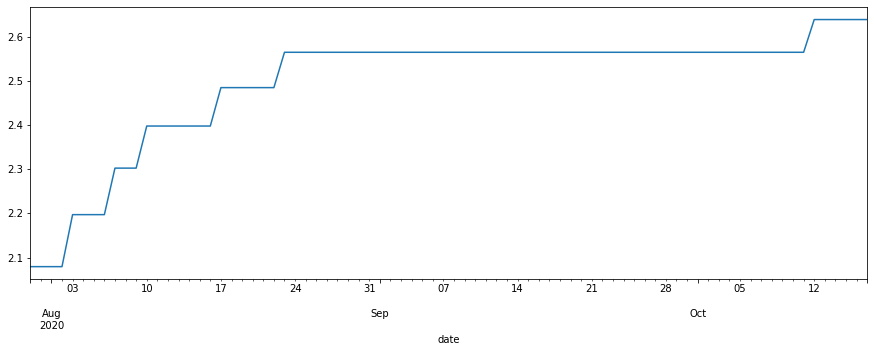
    


    
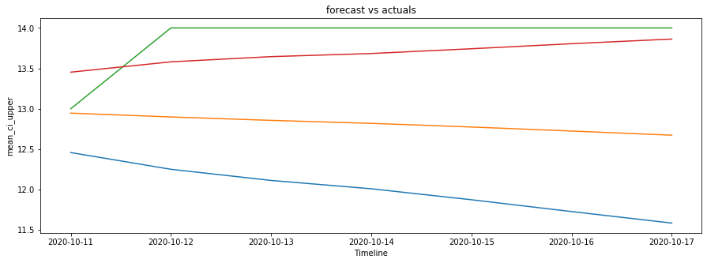
    


```python
# Construct San Francisco county data

# Daily
San_fran = cali[cali['CountyName'] == 'San Francisco']
San_fran['daily_cases'] = San_fran['n_cases'].diff()
San_fran['daily_deaths'] = San_fran['n_deaths'].diff()
San_fran['one_diff_cases'] = San_fran['daily_cases'].diff()
San_fran['one_diff_deaths'] = San_fran['daily_deaths'].diff()

#log

San_fran['log_cases'] = np.log(San_fran['n_cases'])
San_fran['log_deaths'] = np.log(San_fran['n_deaths'])
San_fran['log_diff_cases'] = San_fran['log_cases'].diff()
San_fran['log_diff_deaths'] = San_fran['log_deaths'].diff()


# Construct daily, log counts and first order differences within daily counts and log counts
df3 = San_fran[['date', 'n_cases','n_deaths','daily_cases','daily_deaths', 'one_diff_cases','one_diff_deaths', 'log_cases', 'log_deaths',
              'log_diff_cases', 'log_diff_deaths']]

df3['rolling_mean_cases'] = San_fran.daily_cases.rolling(window=7).mean()
df3['rolling_mean_deaths'] = San_fran.daily_deaths.rolling(window=7).mean()
df3['rolling_mean_one_diff_cases'] = San_fran.one_diff_cases.rolling(window=7).mean()
df3['rolling_mean_one_diff_deaths'] = San_fran.one_diff_deaths.rolling(window=7).mean()


# Analysis of daily Infections & deaths
plt.figure(figsize=(15,10))

plt.subplot(2,2,1)
sns.lineplot(data=df3, x="date", y="daily_cases")
sns.lineplot(data=df3, x="date", y="rolling_mean_cases")
sns.lineplot(data=df3, x="date", y="log_cases")
plt.xlabel("Timeline")
plt.title('Daily Cases vs Rolling Mean(7-day) vs Log of Cases')

plt.subplot(2,2,2)
sns.lineplot(data=df3, x="date", y="one_diff_cases")
sns.lineplot(data=df3, x="date", y="rolling_mean_one_diff_cases")
sns.lineplot(data=df3, x="date", y="log_diff_cases")
plt.xlabel("Timeline")
plt.title('First Order log diffs between Daily Cases vs Rolling Mean(7-day)')

plt.subplot(2,2,3)
sns.lineplot(data=df3, x="date", y="daily_deaths")
sns.lineplot(data=df3, x="date", y="rolling_mean_deaths")
sns.lineplot(data=df3, x="date", y="log_deaths")
plt.xlabel("Timeline")
plt.title('Raw Daily Deaths vs Rolling Mean(7-day) vs Log of Deaths')

plt.subplot(2,2,4)
sns.lineplot(data=df3, x="date", y="one_diff_deaths")
sns.lineplot(data=df3, x="date", y="rolling_mean_one_diff_deaths")
sns.lineplot(data=df3, x="date", y="log_diff_deaths")


plt.xlabel("Timeline")
plt.title('First Order Diffs:Daily Deaths vs Rolling Mean(7-day) vs Log')

plt.show()

# prepare data

df4 = df3.reset_index().drop('countyFIPS', axis = 1)
df4 = df4.set_index('date')
df4.index = pd.to_datetime(df4.index)
df4.index.freq = 'd'
data= df4['2020-04-01':]
```


    
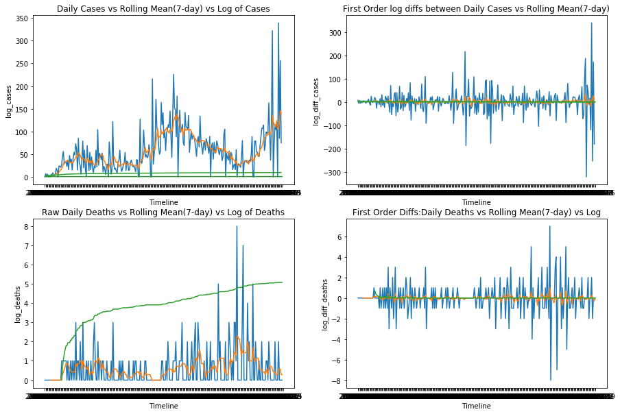
    


```python
# cases-scenario 1

# test for stationarity
adf_test(data.log_cases)
kpss_test(data.log_cases)

# modelling

import statsmodels.api as sm
data1 = data[0:100]
endog = data1['log_cases']
endog.plot(figsize=(15, 5))

# Step 1: fit model parameters w/ training sample

training_endog = endog[:'2020-07-02']
test_endog = endog['2020-07-03':'2020-07-09']
training_mod = sm.tsa.SARIMAX(training_endog, order=(3, 2, 7), trend='c')
training_res = training_mod.fit()

# Print the estimated parameters
print(training_res.params)

# Step 2: produce one-step-ahead forecasts
log_fcast = training_res.get_forecast(7)
results = np.exp(log_fcast.summary_frame())
results['actuals'] = data1['n_cases']
results = results.drop('mean_se', axis =1)
results = results.rename(columns={"mean":"fcast"}, copy =False)
rmse = np.sqrt(((results.actuals - results.fcast)**2).mean())
print(rmse, "RMSE")

# plot results
plt.figure(figsize=(15,5))

sns.lineplot(data = results, x= results.index, y="mean_ci_lower")
sns.lineplot(data = results, x= results.index, y="fcast")
sns.lineplot(data = results, x= results.index, y="actuals")
sns.lineplot(data = results, x= results.index, y="mean_ci_upper")

plt.xlabel("Timeline")
plt.title('forecast vs actuals')


plt.show()
```

    Results of Dickey-Fuller Test:
    Test Statistic                  -1.269791
    p-value                          0.642877
    #Lags Used                      15.000000
    Number of Observations Used    227.000000
    Critical Value (1%)             -3.459490
    Critical Value (5%)             -2.874358
    Critical Value (10%)            -2.573602
    dtype: float64
    Results of KPSS Test:
    Test Statistic            1.567045
    p-value                   0.010000
    Lags Used                15.000000
    Critical Value (10%)      0.347000
    Critical Value (5%)       0.463000
    Critical Value (2.5%)     0.574000
    Critical Value (1%)       0.739000
    dtype: float64


    /Users/raviivaturi/opt/anaconda3/lib/python3.7/site-packages/statsmodels/tsa/stattools.py:1708: InterpolationWarning: p-value is smaller than the indicated p-value
      warn("p-value is smaller than the indicated p-value", InterpolationWarning)
    /Users/raviivaturi/opt/anaconda3/lib/python3.7/site-packages/statsmodels/base/model.py:512: ConvergenceWarning: Maximum Likelihood optimization failed to converge. Check mle_retvals
      "Check mle_retvals", ConvergenceWarning)


    intercept   -0.001254
    ar.L1       -0.454831
    ar.L2       -0.025707
    ar.L3       -0.446877
    ma.L1       -0.489353
    ma.L2       -0.272918
    ma.L3        0.549626
    ma.L4       -0.417329
    ma.L5        0.159791
    ma.L6       -0.075275
    ma.L7       -0.004679
    sigma2       0.000317
    dtype: float64
    88.8028588940433 RMSE


    
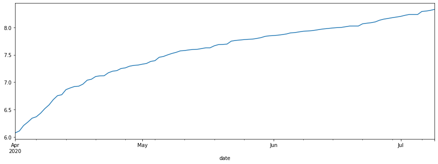
    


    
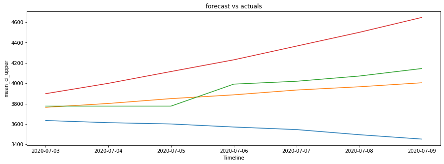
    


```python
# deaths- scenario 1

# test for stationarity
adf_test(data.log_deaths)
kpss_test(data.log_deaths)

# modelling
endog = data1['log_deaths']
endog.plot(figsize=(15, 5))

# Step 1: fit model parameters w/ training sample

training_endog = endog[:'2020-07-02']
test_endog = endog['2020-07-03':'2020-07-09']
training_mod = sm.tsa.SARIMAX(training_endog, order=(14, 2, 7), trend='c')
training_res = training_mod.fit()

# Print the estimated parameters
print(training_res.params)

# Step 2: produce one-step-ahead forecasts
log_fcast = training_res.get_forecast(7)
results = np.exp(log_fcast.summary_frame())
results['actuals'] = data1['n_deaths']
results = results.drop('mean_se', axis =1)
results = results.rename(columns={"mean":"fcast"}, copy =False)
rmse = np.sqrt(((results.actuals - results.fcast)**2).mean())
print(rmse, "RMSE")

# plot results
plt.figure(figsize=(15,5))

sns.lineplot(data = results, x= results.index, y="mean_ci_lower")
sns.lineplot(data = results, x= results.index, y="fcast")
sns.lineplot(data = results, x= results.index, y="actuals")
sns.lineplot(data = results, x= results.index, y="mean_ci_upper")

plt.xlabel("Timeline")
plt.title('forecast vs actuals')

plt.show()
```

    Results of Dickey-Fuller Test:
    Test Statistic                  -1.190371
    p-value                          0.677724
    #Lags Used                      14.000000
    Number of Observations Used    228.000000
    Critical Value (1%)             -3.459361
    Critical Value (5%)             -2.874302
    Critical Value (10%)            -2.573571
    dtype: float64
    Results of KPSS Test:
    Test Statistic            1.536373
    p-value                   0.010000
    Lags Used                15.000000
    Critical Value (10%)      0.347000
    Critical Value (5%)       0.463000
    Critical Value (2.5%)     0.574000
    Critical Value (1%)       0.739000
    dtype: float64


    /Users/raviivaturi/opt/anaconda3/lib/python3.7/site-packages/statsmodels/tsa/stattools.py:1708: InterpolationWarning: p-value is smaller than the indicated p-value
      warn("p-value is smaller than the indicated p-value", InterpolationWarning)
    /Users/raviivaturi/opt/anaconda3/lib/python3.7/site-packages/statsmodels/base/model.py:512: ConvergenceWarning: Maximum Likelihood optimization failed to converge. Check mle_retvals
      "Check mle_retvals", ConvergenceWarning)


    intercept   -0.001711
    ar.L1       -0.535129
    ar.L2       -0.300181
    ar.L3       -0.192987
    ar.L4       -0.127362
    ar.L5       -0.080850
    ar.L6       -0.076562
    ar.L7       -0.129653
    ar.L8        0.013321
    ar.L9        0.031170
    ar.L10      -0.168311
    ar.L11      -0.301007
    ar.L12       0.044308
    ar.L13      -0.057335
    ar.L14       0.266073
    ma.L1       -0.730818
    ma.L2        0.127706
    ma.L3       -0.036486
    ma.L4       -0.095038
    ma.L5        0.050805
    ma.L6       -0.068098
    ma.L7       -0.098919
    sigma2       0.001170
    dtype: float64
    1.6799842527735382 RMSE


    
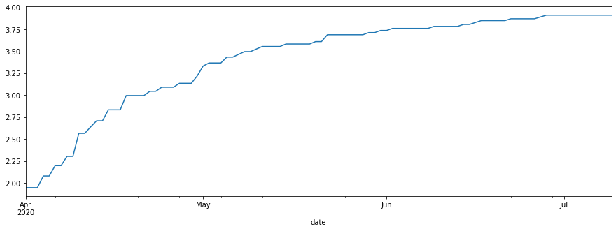
    


    
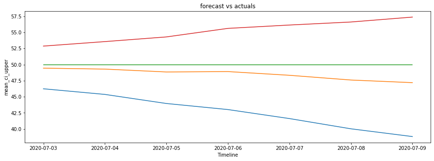
    


```python
# cases -scenario 2
data1 = data[120:200]
endog = data1['log_cases']
endog.plot(figsize=(15, 5))

# Step 1: fit model parameters w/ training sample

training_endog = endog[:'2020-10-10']
test_endog = endog['2020-10-11':'2020-10-17']
training_mod = sm.tsa.SARIMAX(training_endog, order=(3, 2, 7), trend='c')
training_res = training_mod.fit()

# Print the estimated parameters
print(training_res.params)

# Step 2: produce one-step-ahead forecasts
log_fcast = training_res.get_forecast(7)
results = np.exp(log_fcast.summary_frame())
results['actuals'] = data1['n_cases']
results = results.drop('mean_se', axis =1)
results = results.rename(columns={"mean":"fcast"}, copy =False)
rmse = np.sqrt(((results.actuals - results.fcast)**2).mean())
print(rmse, "RMSE")

# plot results
plt.figure(figsize=(15,5))

sns.lineplot(data = results, x= results.index, y="mean_ci_lower")
sns.lineplot(data = results, x= results.index, y="fcast")
sns.lineplot(data = results, x= results.index, y="actuals")
sns.lineplot(data = results, x= results.index, y="mean_ci_upper")

plt.xlabel("Timeline")
plt.title('forecast vs actuals')


plt.show()
```

    intercept   -0.000359
    ar.L1       -0.394820
    ar.L2       -0.234310
    ar.L3       -0.118447
    ma.L1       -0.692047
    ma.L2       -0.070678
    ma.L3        0.136591
    ma.L4       -0.606084
    ma.L5        0.275577
    ma.L6        0.057971
    ma.L7        0.049737
    sigma2       0.000011
    dtype: float64
    79.22008713826092 RMSE


    
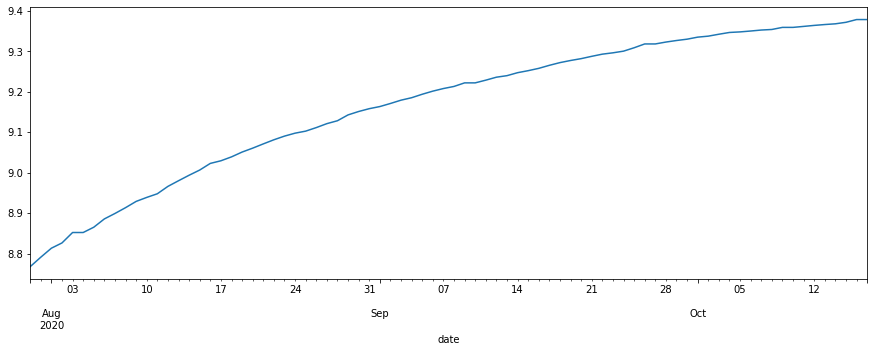
    


    
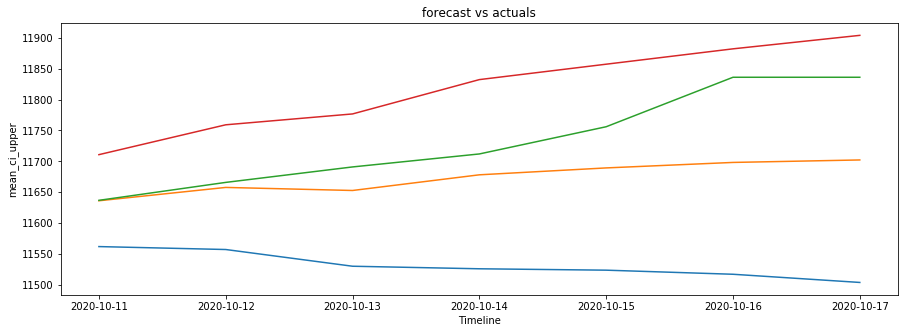
    


```python
# deaths-scenario 2
data1 = data[120:200]
endog = data1['log_deaths']
endog.plot(figsize=(15, 5))

# Step 1: fit model parameters w/ training sample

training_endog = endog[:'2020-10-10']
test_endog = endog['2020-10-11':'2020-10-17']
training_mod = sm.tsa.SARIMAX(training_endog, order=(14, 2, 7), trend='c')
training_res = training_mod.fit()

# Print the estimated parameters
print(training_res.params)

# Step 2: produce one-step-ahead forecasts
log_fcast = training_res.get_forecast(7)
results = np.exp(log_fcast.summary_frame())
results['actuals'] = data1['n_deaths']
results = results.drop('mean_se', axis =1)
results = results.rename(columns={"mean":"fcast"}, copy =False)
rmse = np.sqrt(((results.actuals - results.fcast)**2).mean())
print(rmse, "RMSE")

# plot results
plt.figure(figsize=(15,5))

sns.lineplot(data = results, x= results.index, y="mean_ci_lower")
sns.lineplot(data = results, x= results.index, y="fcast")
sns.lineplot(data = results, x= results.index, y="actuals")
sns.lineplot(data = results, x= results.index, y="mean_ci_upper")

plt.xlabel("Timeline")
plt.title('forecast vs actuals')


plt.show()
```

    /Users/raviivaturi/opt/anaconda3/lib/python3.7/site-packages/statsmodels/base/model.py:512: ConvergenceWarning: Maximum Likelihood optimization failed to converge. Check mle_retvals
      "Check mle_retvals", ConvergenceWarning)


    intercept    0.000093
    ar.L1       -0.599528
    ar.L2       -0.301012
    ar.L3       -0.259551
    ar.L4       -0.225201
    ar.L5       -0.219053
    ar.L6       -0.043784
    ar.L7       -0.063738
    ar.L8       -0.000022
    ar.L9        0.069532
    ar.L10      -0.148427
    ar.L11      -0.174911
    ar.L12      -0.212002
    ar.L13       0.180646
    ar.L14       0.065419
    ma.L1       -0.302698
    ma.L2       -0.358934
    ma.L3       -0.093673
    ma.L4       -0.000790
    ma.L5       -0.148122
    ma.L6       -0.096173
    ma.L7        0.176248
    sigma2       0.000201
    dtype: float64
    2.0416929959201564 RMSE


    
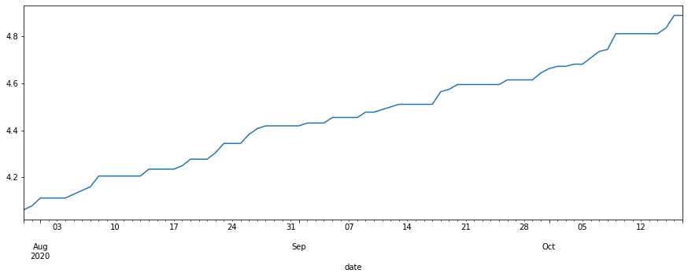
    


    
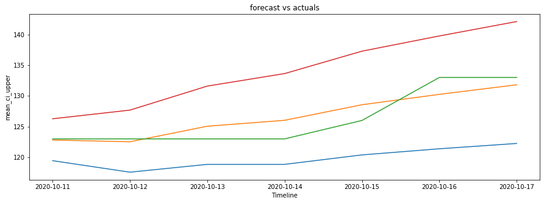
    


```python
cali[cali['CountyName'] =='Contra Costa']
```


<div>
<style scoped>
    .dataframe tbody tr th:only-of-type {
        vertical-align: middle;
    }

    .dataframe tbody tr th {
        vertical-align: top;
    }

    .dataframe thead th {
        text-align: right;
    }
</style>
<table border="1" class="dataframe">
  <thead>
    <tr style="text-align: right;">
      <th></th>
      <th>CountyName</th>
      <th>State</th>
      <th>date</th>
      <th>n_cases</th>
      <th>n_deaths</th>
    </tr>
    <tr>
      <th>countyFIPS</th>
      <th></th>
      <th></th>
      <th></th>
      <th></th>
      <th></th>
    </tr>
  </thead>
  <tbody>
    <tr>
      <td>6013</td>
      <td>Contra Costa</td>
      <td>California</td>
      <td>2020-03-04</td>
      <td>1</td>
      <td>0</td>
    </tr>
    <tr>
      <td>6013</td>
      <td>Contra Costa</td>
      <td>California</td>
      <td>2020-03-05</td>
      <td>1</td>
      <td>0</td>
    </tr>
    <tr>
      <td>6013</td>
      <td>Contra Costa</td>
      <td>California</td>
      <td>2020-03-06</td>
      <td>3</td>
      <td>0</td>
    </tr>
    <tr>
      <td>6013</td>
      <td>Contra Costa</td>
      <td>California</td>
      <td>2020-03-07</td>
      <td>3</td>
      <td>0</td>
    </tr>
    <tr>
      <td>6013</td>
      <td>Contra Costa</td>
      <td>California</td>
      <td>2020-03-08</td>
      <td>9</td>
      <td>0</td>
    </tr>
    <tr>
      <td>...</td>
      <td>...</td>
      <td>...</td>
      <td>...</td>
      <td>...</td>
      <td>...</td>
    </tr>
    <tr>
      <td>6013</td>
      <td>Contra Costa</td>
      <td>California</td>
      <td>2020-11-25</td>
      <td>23381</td>
      <td>260</td>
    </tr>
    <tr>
      <td>6013</td>
      <td>Contra Costa</td>
      <td>California</td>
      <td>2020-11-26</td>
      <td>23571</td>
      <td>261</td>
    </tr>
    <tr>
      <td>6013</td>
      <td>Contra Costa</td>
      <td>California</td>
      <td>2020-11-27</td>
      <td>23571</td>
      <td>261</td>
    </tr>
    <tr>
      <td>6013</td>
      <td>Contra Costa</td>
      <td>California</td>
      <td>2020-11-28</td>
      <td>23895</td>
      <td>261</td>
    </tr>
    <tr>
      <td>6013</td>
      <td>Contra Costa</td>
      <td>California</td>
      <td>2020-11-29</td>
      <td>24275</td>
      <td>261</td>
    </tr>
  </tbody>
</table>
<p>271 rows × 5 columns</p>
</div>


```python
# Construct Contra Costa county data

# Daily
Contra_Costa = cali[cali['CountyName'] == 'Contra Costa']
Contra_Costa['daily_cases'] = Contra_Costa['n_cases'].diff()
Contra_Costa['daily_deaths'] = Contra_Costa['n_deaths'].diff()
Contra_Costa['one_diff_cases'] = Contra_Costa['daily_cases'].diff()
Contra_Costa['one_diff_deaths'] = Contra_Costa['daily_deaths'].diff()

#log

Contra_Costa['log_cases'] = np.log(Contra_Costa['n_cases'])
Contra_Costa['log_deaths'] = np.log(Contra_Costa['n_deaths'])
Contra_Costa['log_diff_cases'] = Contra_Costa['log_cases'].diff()
Contra_Costa['log_diff_deaths'] = Contra_Costa['log_deaths'].diff()


# Construct daily, log counts and first order differences within daily counts and log counts
df3 = Contra_Costa[['date', 'n_cases','n_deaths','daily_cases','daily_deaths', 'one_diff_cases','one_diff_deaths', 'log_cases', 'log_deaths',
              'log_diff_cases', 'log_diff_deaths']]

df3['rolling_mean_cases'] = Contra_Costa.daily_cases.rolling(window=7).mean()
df3['rolling_mean_deaths'] = Contra_Costa.daily_deaths.rolling(window=7).mean()
df3['rolling_mean_one_diff_cases'] = Contra_Costa.one_diff_cases.rolling(window=7).mean()
df3['rolling_mean_one_diff_deaths'] = Contra_Costa.one_diff_deaths.rolling(window=7).mean()


# Analysis of daily Infections & deaths
plt.figure(figsize=(15,10))

plt.subplot(2,2,1)
sns.lineplot(data=df3, x="date", y="daily_cases")
sns.lineplot(data=df3, x="date", y="rolling_mean_cases")
sns.lineplot(data=df3, x="date", y="log_cases")
plt.xlabel("Timeline")
plt.title('Daily Cases vs Rolling Mean(7-day) vs Log of Cases')

plt.subplot(2,2,2)
sns.lineplot(data=df3, x="date", y="one_diff_cases")
sns.lineplot(data=df3, x="date", y="rolling_mean_one_diff_cases")
sns.lineplot(data=df3, x="date", y="log_diff_cases")
plt.xlabel("Timeline")
plt.title('First Order log diffs between Daily Cases vs Rolling Mean(7-day)')

plt.subplot(2,2,3)
sns.lineplot(data=df3, x="date", y="daily_deaths")
sns.lineplot(data=df3, x="date", y="rolling_mean_deaths")
sns.lineplot(data=df3, x="date", y="log_deaths")
plt.xlabel("Timeline")
plt.title('Raw Daily Deaths vs Rolling Mean(7-day) vs Log of Deaths')

plt.subplot(2,2,4)
sns.lineplot(data=df3, x="date", y="one_diff_deaths")
sns.lineplot(data=df3, x="date", y="rolling_mean_one_diff_deaths")
sns.lineplot(data=df3, x="date", y="log_diff_deaths")


plt.xlabel("Timeline")
plt.title('First Order Diffs:Daily Deaths vs Rolling Mean(7-day) vs Log')

plt.show()

# prepare data

df4 = df3.reset_index().drop('countyFIPS', axis = 1)
df4 = df4.set_index('date')
df4.index = pd.to_datetime(df4.index)
df4.index.freq = 'd'
data= df4['2020-04-01':]
```


    
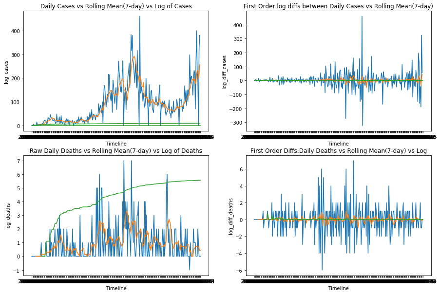
    


```python
# cases-scenario 1

# test for stationarity
adf_test(data.log_cases)
kpss_test(data.log_cases)

# modelling

import statsmodels.api as sm
data1 = data[0:100]
endog = data1['log_cases']
endog.plot(figsize=(15, 5))

# Step 1: fit model parameters w/ training sample

training_endog = endog[:'2020-07-02']
test_endog = endog['2020-07-03':'2020-07-09']
training_mod = sm.tsa.SARIMAX(training_endog, order=(3, 2, 7), trend='c')
training_res = training_mod.fit()

# Print the estimated parameters
print(training_res.params)

# Step 2: produce one-step-ahead forecasts
log_fcast = training_res.get_forecast(7)
results = np.exp(log_fcast.summary_frame())
results['actuals'] = data1['n_cases']
results = results.drop('mean_se', axis =1)
results = results.rename(columns={"mean":"fcast"}, copy =False)
rmse = np.sqrt(((results.actuals - results.fcast)**2).mean())
print(rmse, "RMSE")

# plot results
plt.figure(figsize=(15,5))

sns.lineplot(data = results, x= results.index, y="mean_ci_lower")
sns.lineplot(data = results, x= results.index, y="fcast")
sns.lineplot(data = results, x= results.index, y="actuals")
sns.lineplot(data = results, x= results.index, y="mean_ci_upper")

plt.xlabel("Timeline")
plt.title('forecast vs actuals')


plt.show()
```

    Results of Dickey-Fuller Test:
    Test Statistic                  -1.209116
    p-value                          0.669662
    #Lags Used                      14.000000
    Number of Observations Used    228.000000
    Critical Value (1%)             -3.459361
    Critical Value (5%)             -2.874302
    Critical Value (10%)            -2.573571
    dtype: float64
    Results of KPSS Test:
    Test Statistic            1.577374
    p-value                   0.010000
    Lags Used                15.000000
    Critical Value (10%)      0.347000
    Critical Value (5%)       0.463000
    Critical Value (2.5%)     0.574000
    Critical Value (1%)       0.739000
    dtype: float64


    /Users/raviivaturi/opt/anaconda3/lib/python3.7/site-packages/statsmodels/tsa/stattools.py:1708: InterpolationWarning: p-value is smaller than the indicated p-value
      warn("p-value is smaller than the indicated p-value", InterpolationWarning)
    /Users/raviivaturi/opt/anaconda3/lib/python3.7/site-packages/statsmodels/base/model.py:512: ConvergenceWarning: Maximum Likelihood optimization failed to converge. Check mle_retvals
      "Check mle_retvals", ConvergenceWarning)


    intercept   -0.002673
    ar.L1       -1.022831
    ar.L2       -0.801575
    ar.L3       -0.456488
    ma.L1        0.438179
    ma.L2        0.162313
    ma.L3        0.020569
    ma.L4        0.083173
    ma.L5        0.140196
    ma.L6       -0.048430
    ma.L7        0.044511
    sigma2       0.000214
    dtype: float64
    77.08852065623446 RMSE


    
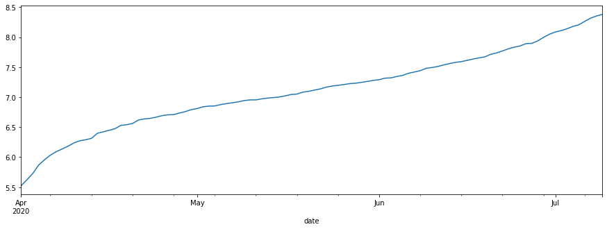
    


    
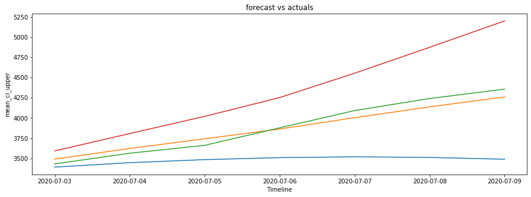
    


```python
# deaths- scenario 1

# test for stationarity
adf_test(data.log_deaths)
kpss_test(data.log_deaths)

# modelling
endog = data1['log_deaths']
endog.plot(figsize=(15, 5))

# Step 1: fit model parameters w/ training sample

training_endog = endog[:'2020-07-02']
test_endog = endog['2020-07-03':'2020-07-09']
training_mod = sm.tsa.SARIMAX(training_endog, order=(14, 2, 7), trend='c')
training_res = training_mod.fit()

# Print the estimated parameters
print(training_res.params)

# Step 2: produce one-step-ahead forecasts
log_fcast = training_res.get_forecast(7)
results = np.exp(log_fcast.summary_frame())
results['actuals'] = data1['n_deaths']
results = results.drop('mean_se', axis =1)
results = results.rename(columns={"mean":"fcast"}, copy =False)
rmse = np.sqrt(((results.actuals - results.fcast)**2).mean())
print(rmse, "RMSE")

# plot results
plt.figure(figsize=(15,5))

sns.lineplot(data = results, x= results.index, y="mean_ci_lower")
sns.lineplot(data = results, x= results.index, y="fcast")
sns.lineplot(data = results, x= results.index, y="actuals")
sns.lineplot(data = results, x= results.index, y="mean_ci_upper")

plt.xlabel("Timeline")
plt.title('forecast vs actuals')

plt.show()
```

    Results of Dickey-Fuller Test:
    Test Statistic                  -1.736692
    p-value                          0.412313
    #Lags Used                      15.000000
    Number of Observations Used    227.000000
    Critical Value (1%)             -3.459490
    Critical Value (5%)             -2.874358
    Critical Value (10%)            -2.573602
    dtype: float64
    Results of KPSS Test:
    Test Statistic            1.536851
    p-value                   0.010000
    Lags Used                15.000000
    Critical Value (10%)      0.347000
    Critical Value (5%)       0.463000
    Critical Value (2.5%)     0.574000
    Critical Value (1%)       0.739000
    dtype: float64


    /Users/raviivaturi/opt/anaconda3/lib/python3.7/site-packages/statsmodels/tsa/stattools.py:1708: InterpolationWarning: p-value is smaller than the indicated p-value
      warn("p-value is smaller than the indicated p-value", InterpolationWarning)
    /Users/raviivaturi/opt/anaconda3/lib/python3.7/site-packages/statsmodels/base/model.py:512: ConvergenceWarning: Maximum Likelihood optimization failed to converge. Check mle_retvals
      "Check mle_retvals", ConvergenceWarning)


    intercept   -0.002789
    ar.L1       -0.648239
    ar.L2       -0.029851
    ar.L3       -0.112124
    ar.L4       -0.271543
    ar.L5       -0.079753
    ar.L6        0.000321
    ar.L7       -0.076637
    ar.L8        0.205767
    ar.L9        0.170135
    ar.L10      -0.238387
    ar.L11      -0.273490
    ar.L12       0.246715
    ar.L13       0.368040
    ar.L14      -0.091172
    ma.L1       -0.479195
    ma.L2       -0.245280
    ma.L3       -0.098326
    ma.L4       -0.009222
    ma.L5        0.288241
    ma.L6        0.040213
    ma.L7       -0.184284
    sigma2       0.002947
    dtype: float64
    2.963351303308679 RMSE


    
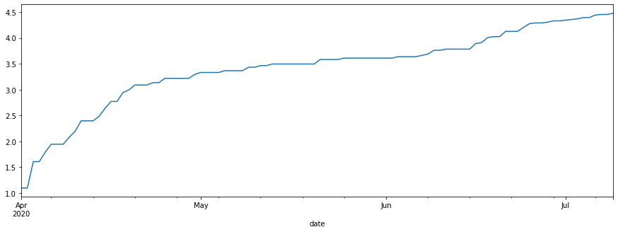
    


    
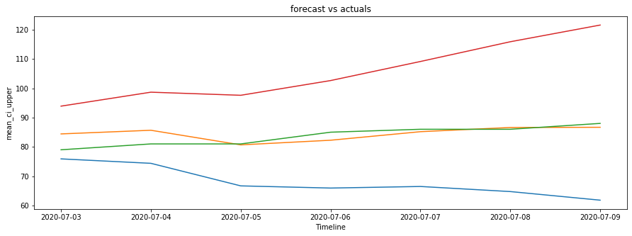
    


```python
# cases -scenario 2
data1 = data[120:200]
endog = data1['log_cases']
endog.plot(figsize=(15, 5))

# Step 1: fit model parameters w/ training sample

training_endog = endog[:'2020-10-10']
test_endog = endog['2020-10-11':'2020-10-17']
training_mod = sm.tsa.SARIMAX(training_endog, order=(3, 2, 7), trend='c')
training_res = training_mod.fit()

# Print the estimated parameters
print(training_res.params)

# Step 2: produce one-step-ahead forecasts
log_fcast = training_res.get_forecast(7)
results = np.exp(log_fcast.summary_frame())
results['actuals'] = data1['n_cases']
results = results.drop('mean_se', axis =1)
results = results.rename(columns={"mean":"fcast"}, copy =False)
rmse = np.sqrt(((results.actuals - results.fcast)**2).mean())
print(rmse, "RMSE")

# plot results
plt.figure(figsize=(15,5))

sns.lineplot(data = results, x= results.index, y="mean_ci_lower")
sns.lineplot(data = results, x= results.index, y="fcast")
sns.lineplot(data = results, x= results.index, y="actuals")
sns.lineplot(data = results, x= results.index, y="mean_ci_upper")

plt.xlabel("Timeline")
plt.title('forecast vs actuals')


plt.show()
```

    intercept   -0.000271
    ar.L1       -0.827214
    ar.L2       -0.169398
    ar.L3        0.035494
    ma.L1        0.080397
    ma.L2       -0.375358
    ma.L3       -0.088223
    ma.L4        0.367254
    ma.L5        0.097360
    ma.L6       -0.029502
    ma.L7        0.123300
    sigma2       0.000034
    dtype: float64
    65.94500063054464 RMSE


    
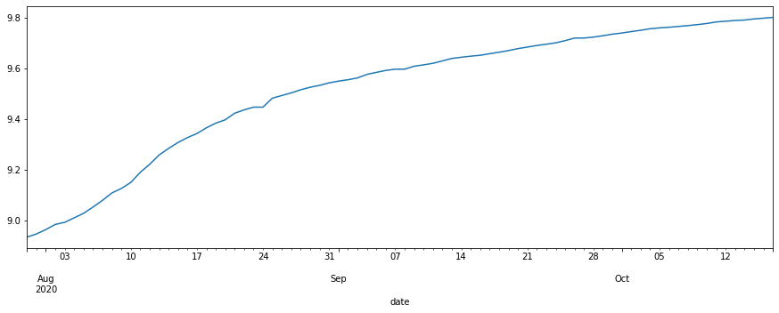
    


    
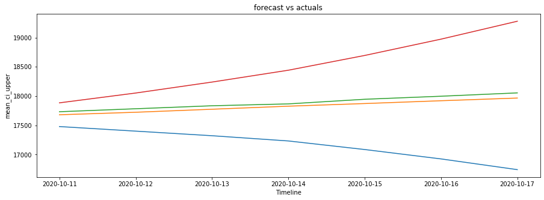
    


```python
# deaths-scenario 2
data1 = data[120:200]
endog = data1['log_deaths']
endog.plot(figsize=(15, 5))

# Step 1: fit model parameters w/ training sample

training_endog = endog[:'2020-10-10']
test_endog = endog['2020-10-11':'2020-10-17']
training_mod = sm.tsa.SARIMAX(training_endog, order=(14, 2, 7), trend='c')
training_res = training_mod.fit()

# Print the estimated parameters
print(training_res.params)

# Step 2: produce one-step-ahead forecasts
log_fcast = training_res.get_forecast(7)
results = np.exp(log_fcast.summary_frame())
results['actuals'] = data1['n_deaths']
results = results.drop('mean_se', axis =1)
results = results.rename(columns={"mean":"fcast"}, copy =False)
rmse = np.sqrt(((results.actuals - results.fcast)**2).mean())
print(rmse, "RMSE")

# plot results
plt.figure(figsize=(15,5))

sns.lineplot(data = results, x= results.index, y="mean_ci_lower")
sns.lineplot(data = results, x= results.index, y="fcast")
sns.lineplot(data = results, x= results.index, y="actuals")
sns.lineplot(data = results, x= results.index, y="mean_ci_upper")

plt.xlabel("Timeline")
plt.title('forecast vs actuals')


plt.show()
```

    /Users/raviivaturi/opt/anaconda3/lib/python3.7/site-packages/statsmodels/base/model.py:512: ConvergenceWarning: Maximum Likelihood optimization failed to converge. Check mle_retvals
      "Check mle_retvals", ConvergenceWarning)


    intercept   -0.000168
    ar.L1       -0.422506
    ar.L2       -0.316560
    ar.L3       -0.283565
    ar.L4       -0.134100
    ar.L5       -0.125606
    ar.L6       -0.168354
    ar.L7        0.034258
    ar.L8       -0.051199
    ar.L9        0.191214
    ar.L10       0.160267
    ar.L11       0.359742
    ar.L12       0.054941
    ar.L13       0.113648
    ar.L14       0.147503
    ma.L1       -0.416562
    ma.L2       -0.053067
    ma.L3       -0.125358
    ma.L4       -0.081508
    ma.L5        0.153684
    ma.L6       -0.190175
    ma.L7       -0.006451
    sigma2       0.000069
    dtype: float64
    7.601372634832044 RMSE


    
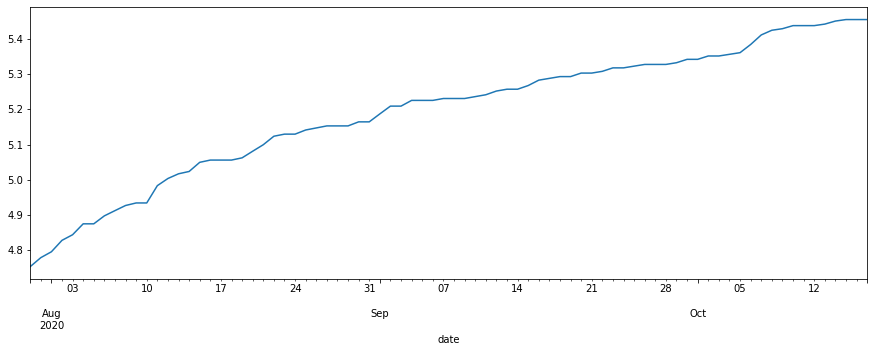
    


    
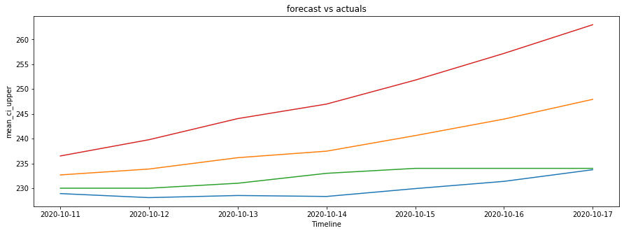
    


```python
data.tail(8)
```


<div>
<style scoped>
    .dataframe tbody tr th:only-of-type {
        vertical-align: middle;
    }

    .dataframe tbody tr th {
        vertical-align: top;
    }

    .dataframe thead th {
        text-align: right;
    }
</style>
<table border="1" class="dataframe">
  <thead>
    <tr style="text-align: right;">
      <th></th>
      <th>n_cases</th>
      <th>n_deaths</th>
      <th>daily_cases</th>
      <th>daily_deaths</th>
      <th>one_diff_cases</th>
      <th>one_diff_deaths</th>
      <th>log_cases</th>
      <th>log_deaths</th>
      <th>log_diff_cases</th>
      <th>log_diff_deaths</th>
      <th>rolling_mean_cases</th>
      <th>rolling_mean_deaths</th>
      <th>rolling_mean_one_diff_cases</th>
      <th>rolling_mean_one_diff_deaths</th>
    </tr>
    <tr>
      <th>date</th>
      <th></th>
      <th></th>
      <th></th>
      <th></th>
      <th></th>
      <th></th>
      <th></th>
      <th></th>
      <th></th>
      <th></th>
      <th></th>
      <th></th>
      <th></th>
      <th></th>
    </tr>
  </thead>
  <tbody>
    <tr>
      <td>2020-11-22</td>
      <td>22482</td>
      <td>258</td>
      <td>70.0</td>
      <td>0.0</td>
      <td>-151.0</td>
      <td>-1.0</td>
      <td>10.020470</td>
      <td>5.552960</td>
      <td>0.003118</td>
      <td>0.000000</td>
      <td>176.000000</td>
      <td>0.714286</td>
      <td>-19.142857</td>
      <td>0.000000</td>
    </tr>
    <tr>
      <td>2020-11-23</td>
      <td>22747</td>
      <td>258</td>
      <td>265.0</td>
      <td>0.0</td>
      <td>195.0</td>
      <td>0.0</td>
      <td>10.032189</td>
      <td>5.552960</td>
      <td>0.011718</td>
      <td>0.000000</td>
      <td>184.142857</td>
      <td>0.714286</td>
      <td>8.142857</td>
      <td>0.000000</td>
    </tr>
    <tr>
      <td>2020-11-24</td>
      <td>23146</td>
      <td>258</td>
      <td>399.0</td>
      <td>0.0</td>
      <td>134.0</td>
      <td>0.0</td>
      <td>10.049577</td>
      <td>5.552960</td>
      <td>0.017389</td>
      <td>0.000000</td>
      <td>216.571429</td>
      <td>0.714286</td>
      <td>32.428571</td>
      <td>0.000000</td>
    </tr>
    <tr>
      <td>2020-11-25</td>
      <td>23381</td>
      <td>260</td>
      <td>235.0</td>
      <td>2.0</td>
      <td>-164.0</td>
      <td>2.0</td>
      <td>10.059679</td>
      <td>5.560682</td>
      <td>0.010102</td>
      <td>0.007722</td>
      <td>231.857143</td>
      <td>0.714286</td>
      <td>15.285714</td>
      <td>0.000000</td>
    </tr>
    <tr>
      <td>2020-11-26</td>
      <td>23571</td>
      <td>261</td>
      <td>190.0</td>
      <td>1.0</td>
      <td>-45.0</td>
      <td>-1.0</td>
      <td>10.067772</td>
      <td>5.564520</td>
      <td>0.008093</td>
      <td>0.003839</td>
      <td>230.285714</td>
      <td>0.714286</td>
      <td>-1.571429</td>
      <td>0.000000</td>
    </tr>
    <tr>
      <td>2020-11-27</td>
      <td>23571</td>
      <td>261</td>
      <td>0.0</td>
      <td>0.0</td>
      <td>-190.0</td>
      <td>-1.0</td>
      <td>10.067772</td>
      <td>5.564520</td>
      <td>0.000000</td>
      <td>0.000000</td>
      <td>197.142857</td>
      <td>0.571429</td>
      <td>-33.142857</td>
      <td>-0.142857</td>
    </tr>
    <tr>
      <td>2020-11-28</td>
      <td>23895</td>
      <td>261</td>
      <td>324.0</td>
      <td>0.0</td>
      <td>324.0</td>
      <td>0.0</td>
      <td>10.081425</td>
      <td>5.564520</td>
      <td>0.013652</td>
      <td>0.000000</td>
      <td>211.857143</td>
      <td>0.428571</td>
      <td>14.714286</td>
      <td>-0.142857</td>
    </tr>
    <tr>
      <td>2020-11-29</td>
      <td>24275</td>
      <td>261</td>
      <td>380.0</td>
      <td>0.0</td>
      <td>56.0</td>
      <td>0.0</td>
      <td>10.097202</td>
      <td>5.564520</td>
      <td>0.015778</td>
      <td>0.000000</td>
      <td>256.142857</td>
      <td>0.428571</td>
      <td>44.285714</td>
      <td>0.000000</td>
    </tr>
  </tbody>
</table>
</div>


